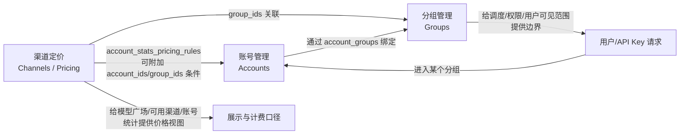

---
doc_type: explore
type: question
status: active
confidence: high
created: 2026-04-27
updated: 2026-04-27
slug: group-account-channel-pricing
question: 分组管理、账号管理、渠道定价三者之间是什么关系？
---

# 速答

一句话：

- 分组是调度与权限的“承载层”
- 账号是实际可用的上游资源池
- 渠道定价是面向分组暴露出来的“展示/计费视图”

三者不是并列关系，而是：

1. 账号通过 `account_groups` 多对多绑定到分组；调度时实际是“按分组找账号池”
2. 渠道再把一批分组挂到自己名下，并为这些分组定义模型定价与展示规则
3. 因为渠道是按分组挂载的，所以“渠道定价”并不直接绑账号，而是主要绑分组；账号只在更细粒度的统计定价规则里作为附加筛选条件出现

最容易混淆的点：

- 分组不是价格表，它本身主要定义平台、倍率、限制、路由与账号池边界
- 账号不是用户直接看到的“售卖单元”，账号更多是后台调度资源
- 渠道定价不是调度入口，它更像“把哪些分组以什么模型价格展示出去”的包装层

# 关键结论

## 1. 分组是核心中间层，位于“账号池”和“用户访问范围”之间

分组既反向关联账号，也承载 API Key、订阅、usage 等对象，因此它是系统里最核心的边界层。

影响：
- 账号先进入某个分组，才能被该分组承载的流量使用
- 后续无论是用户授权、模型广场展示、还是定价聚合，都是先看分组，再向后关联账号或渠道

## 2. 账号管理负责“资源供给”，分组管理负责“资源编排”

账号管理页加载分组列表，创建/编辑账号时直接设置 `group_ids`，说明账号管理把“账号属于哪些分组”当成基础属性。

影响：
- 新增账号时，要先决定它进哪个分组
- 同一个账号可以属于多个分组
- 分组页还能从已有分组复制账号，进一步说明“分组 = 账号池编排单元”

## 3. 渠道定价是按分组挂载的，不是按账号挂载的

渠道对象有 `GroupIDs` 字段，创建/更新时都会检查这些分组是否已属于别的渠道；同一分组不能同时挂在多个渠道下。

影响：
- 一个分组在“渠道视图”里只能归属一个渠道
- 渠道本质上是“面向一批分组的定价与展示包装”
- 所以模型广场/可用渠道看到的是“分组聚合后的渠道价格”，不是裸账号价格

## 4. 账号只在“账号统计定价规则”里对渠道定价产生次级影响

渠道除了主 `model_pricing` 外，还有：
- `apply_pricing_to_account_stats`
- `account_stats_pricing_rules`

这些规则既可以按 `group_ids` 过滤，也可以按 `account_ids` 过滤。

影响：
- 主渠道定价：面向分组整体
- 账号统计定价：允许针对部分账号/分组覆盖口径
- 所以“渠道定价和账号管理”的直接耦合点，不在主价格表，而在统计规则层

## 5. 分组里混放某些平台账号，会在账号绑定时触发风险提示

系统在把账号绑定到分组时，会检查目标分组中是否同时存在 Anthropic 与 Antigravity 账号；若混放，会返回 `mixed_channel_warning` 让前端确认。

影响：
- 分组不仅是列表分类，还是运行时兼容性边界
- 这也是为什么账号管理和分组管理不能拆开看

# 关键证据

1. 账号与分组是多对多关系，通过 `account_groups` 中间表实现，且中间表还有 `priority` 字段，说明这不是简单标签。
   - `D:\data\sub2api\backend\ent\schema\account.go:201-206`
   - `D:\data\sub2api\backend\ent\schema\group.go:158-164`
   - `D:\data\sub2api\backend\ent\schema\account_group.go:15-39`

2. 账号服务在创建/更新账号时直接处理 `GroupIDs`，并调用 `BindGroups` 落库，说明账号归属分组是账号管理的核心动作。
   - `D:\data\sub2api\backend\internal\service\account_service.go:146-192`
   - `D:\data\sub2api\backend\internal\service\account_service.go:281-308`

3. 账号管理页启动时就加载 `groups.getAll()`，且过滤逻辑直接按 `account.group_ids` 判断，说明前台交互也是以“账号属于哪些分组”为主线。
   - `D:\data\sub2api\frontend\src\views\admin\AccountsView.vue:1476-1484`
   - `D:\data\sub2api\frontend\src\views\admin\AccountsView.vue:1257-1260`

4. 分组管理页不仅展示 `account_count / active_account_count / rate_limited_account_count`，还支持“从分组复制账号”，说明分组本身就是账号池运营单元。
   - `D:\data\sub2api\frontend\src\views\admin\GroupsView.vue:196-237`
   - `D:\data\sub2api\frontend\src\views\admin\GroupsView.vue:399-470`
   - `D:\data\sub2api\frontend\src\views\admin\GroupsView.vue:2922-2945`
   - `D:\data\sub2api\backend\internal\handler\admin\group_handler.go:116-153`

5. 渠道对象直接持有 `GroupIDs`、`ModelPricing`、`ApplyPricingToAccountStats`、`AccountStatsPricingRules`，说明“渠道”是挂在分组上的价格与展示层。
   - `D:\data\sub2api\backend\internal\service\channel.go:35-56`
   - `D:\data\sub2api\backend\internal\service\channel.go:66-80`

6. 渠道创建/更新时会检查 `group_ids` 是否已在其他渠道中使用；冲突就报错，证明同一分组只能属于一个渠道。
   - `D:\data\sub2api\backend\internal\service\channel_service.go:678-695`
   - `D:\data\sub2api\backend\internal\service\channel_service.go:792-796`
   - `D:\data\sub2api\backend\internal\service\channel_service.go:819-830`
   - `D:\data\sub2api\backend\internal\repository\channel_repo.go:467`

7. 渠道定价页本身也是先加载全部分组，再在各平台 section 里选择 `group_ids`；而统计定价规则又允许基于这些分组继续筛选。
   - `D:\data\sub2api\frontend\src\views\admin\ChannelsView.vue:1144-1152`
   - `D:\data\sub2api\frontend\src\views\admin\ChannelsView.vue:281-320`
   - `D:\data\sub2api\frontend\src\views\admin\ChannelsView.vue:431-470`
   - `D:\data\sub2api\frontend\src\views\admin\ChannelsView.vue:1399-1430`

8. 账号绑定分组时会触发混合渠道风险检查，说明分组还是运行时兼容性边界，而不只是管理维度。
   - `D:\data\sub2api\backend\internal\service\admin_service.go:3021-3067`
   - `D:\data\sub2api\backend\internal\service\admin_service.go:3186-3195`
   - `D:\data\sub2api\frontend\src\components\account\CreateAccountModal.vue:3769-3799`
   - `D:\data\sub2api\frontend\src\components\account\EditAccountModal.vue:2893-2934`

# 我对这三个页面的实操理解

## 分组管理

你在这里定义的是“一个业务/调度边界”：
- 平台
- 倍率
- 是否独享
- 各类限制
- 账号池归属

它回答的问题是：
- 这批流量/用户应该走哪一池账号？
- 这池资源的规则是什么？

## 账号管理

你在这里管理的是“原材料”：
- 具体是哪一个上游账号
- 凭证、状态、并发、优先级
- 这个账号被投放到哪些分组里

它回答的问题是：
- 这台机器里到底有哪些可调度资源？
- 每个资源放进哪些资源池？

## 渠道定价

你在这里管理的是“面向用户展示/计费的包装层”：
- 哪些分组被归到同一个渠道
- 这些分组对外展示哪些模型和价格
- 账号统计要不要复用这个价格，或按规则覆盖

它回答的问题是：
- 用户在模型广场/可用渠道里看到什么？
- 这批分组对外按什么口径计费展示？

# 一个最实用的心智模型

可以把它理解成三层：

- 账号管理 = 仓库里的机器
- 分组管理 = 机器被编进哪些生产线
- 渠道定价 = 这几条生产线对外售卖成什么商品、标什么价

所以你改这三处时的影响面通常是：

- 改账号管理：影响“供给能力”和调度质量
- 改分组管理：影响“哪些账号服务哪些流量”
- 改渠道定价：影响“用户看到什么价格/模型，以及统计口径”

# 后续建议

如果你接下来是想做部署或运营配置，我建议下一步单独再看一个问题：

- “模型广场的数据到底是从分组出发拼出来的，还是从渠道出发拼出来的？”

这个问题再顺着用户端接口走一遍，就能把“配置完这三处后，前台最终怎么显示”彻底串起来。
