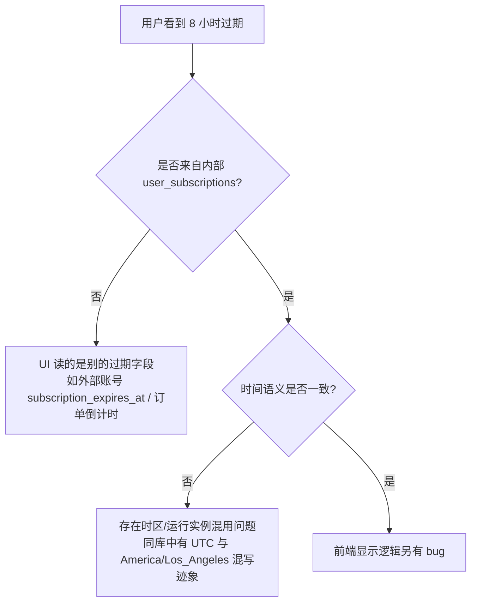

## 问题与范围
排查“用户在 2026-05-06 10:17:58 获得 1 天订阅，但约 15:00 被提示仅剩 8 小时过期”是否由后端过期时间写错、接口序列化偏差，还是前端展示读了别的字段导致。

## 速答
当前库里这条用户订阅记录本身是正确的：`starts_at=2026-05-06 10:17:58`，`expires_at=2026-05-07 10:17:58`，符合“1 天 = 从生效时刻起约 24 小时”的实现，不是“次日 0 点过期”。因此“15 点仅剩 8 小时”不是这条内部订阅记录直接算出来的结果。

更可能的原因有两类：

已确认：
- 兑换得到的内部订阅 `id=52` 过期时间正确，不支持“8 小时剩余”这个结论。
- 仓库里用户订阅页面本身也没有“还有 X 小时过期”的文案实现，更多是显示“剩余天数/到期日期”。
- 同库记录存在时区语义不一致迹象，说明系统里确实有“同一张表被不同时间语义写入”的风险，但这次 `id=52` 这条记录本身不是 8 小时问题的直接证据。

## 关键证据
1. `backend/internal/service/subscription_service.go:212-216`
   - 订阅分配/续期使用 `now.AddDate(0, 0, validityDays)`。
   - 结论：`validity_days=1` 的语义是“当前时刻 + 1 天”，不是“次日 0 点”。

2. `backend/internal/service/redeem_service.go:349-356`
   - 兑换订阅时直接把兑换码 `ValidityDays` 传给 `AssignOrExtendSubscription`。
   - 结论：兑换链路不会额外把 1 天改写为“当天结束”。

3. 数据库实查 `user_subscriptions.id=52`
   - `starts_at=2026-05-06 10:17:58.903196`
   - `expires_at=2026-05-07 10:17:58.903196`
   - `source=redeem`
   - 结论：这条真实订阅记录对应剩余时间在 2026-05-06 15:00 左右应约为 19 小时，而不是 8 小时。

4. `frontend/src/views/user/SubscriptionsView.vue:296-312`
   - 用户订阅页只按 `expires_at` 算“今天/明天/剩余天数”，并未显示“还剩几小时过期”。
   - 结论：用户看到的“8 小时”大概率不是来自这个页面逻辑。

5. `frontend/src/views/user/PaymentView.vue:317-320`
   - 支付页活跃订阅摘要也是 `Math.ceil((expiresAt - Date.now()) / 24h)`，显示天数，不显示小时。
   - 结论：支付页摘要也不是“8 小时过期”文案来源。

6. `backend/internal/config/config.go:991-1009` 与数据库变量实查
   - DSN 强制 `loc=America/Los_Angeles`；但数据库 `time_zone=SYSTEM`、`system_time_zone=UTC`。
   - 同时 `user_subscriptions.id=52` 的 `updated_at` 出现比 `created_at` 更早的表象（`07:33` vs `10:17`），说明同库已有 UTC/上海时间语义混用迹象。
   - 结论：系统存在时区混写风险，值得继续查具体是哪个 UI/服务在读或写了偏移后的过期时间。

## 细节展开
- 今日唯一订阅订单 `payment_orders.id=16` 为 `status=CANCELLED`，未支付完成，且 `created_at=00:18`、`expires_at=00:23` 只是订单 5 分钟支付超时，不是用户最终订阅来源。
- 真实生效的这条订阅来自兑换（`source=redeem`），不是支付成功发放的订阅。
- 仓库中能找到的“小时级倒计时”主要是支付二维码倒计时、临时不可调度倒计时、通用 countdown 工具；没有直接用于用户订阅页的小时级过期提示实现。

## 未决问题
1. 用户看到“还有 8 小时过期”的具体页面/组件是哪一个？
2. 该页面读的是内部订阅 `expires_at`，还是外部账号 `subscription_expires_at` / 订单 `expires_at` / 其他字段？
3. 是否有多个后端实例以不同 OS 时区运行，导致同库 datetime 语义不一致？

## 后续建议
下一步应直接定位用户看到该提示的具体页面或接口响应，确认它读取的到底是不是 `user_subscriptions.expires_at`。

## 相关文档
- `backend/internal/service/subscription_service.go`
- `backend/internal/service/redeem_service.go`
- `frontend/src/views/user/SubscriptionsView.vue`
- `frontend/src/views/user/PaymentView.vue`
