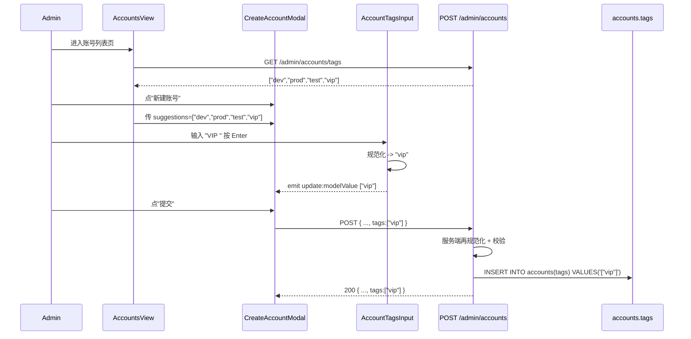

# 账号标签功能 design

## 0. 术语约定

| 术语 | 定义 | 防冲突结论 |
|---|---|---|
| 账号标签 / account tag | 账号上的字符串数组属性，由管理员自由打、自由筛选；纯管理维度，运行时调度链路完全看不到。落库字段：`accounts.tags JSONB` | 后端 schema 已 grep `tag` / `tags`，无任何 schema 命名冲突（仅有 `etag`、`html-tag` 等无关命中）。前端有 `frontend/src/components/admin/channel/ModelTagInput.vue`，但语义是"渠道下的模型名列表"，UI 上视觉相近但属于另一维度——避免命名混淆即可，本 feature 新建组件名为 `AccountTagsInput.vue`，不复用、不重名。 |
| 分组 / group / account_groups | 调度与权限的承载层，账号通过 `account_groups` 中间表（带 `priority`）多对多绑定到分组——这是运行时调度边界 | 引入"账号标签"后必须明确：**标签 ≠ 分组**。分组决定"哪些流量能用这个账号"，标签只决定"列表里看不看得见"。第 1 节决策与约束已锁死这条边界，UI 上还会用一行说明文字告诉管理员。 |
| AND 筛选 | 列表请求 `?tags=vip&tags=prod` 表示"必须同时具备 vip 和 prod"。SQL 实现：`WHERE tags @> '["vip","prod"]'` | 用户已确认这一语义。和现有 `platform` / `status` / `group` 单值筛选不同，`tags` 是多值且语义明确为 AND，文档和代码注释都要写清楚以免后人按 OR 改坏。 |

防冲突 grep 命令与命中清单：

- `rg -n "\"tag\"|\"tags\"|Tag |TagID |account_tags|account_tag|accountTag" backend/` → 命中均为 `etag` / `html-tag` / `golang-migrate` 内部 tag，无业务字段冲突
- `rg -in "label" backend/ent/schema/` → 仅 `user_attribute_definition.go:64` 注释提到 select 选项的 label，无 schema 字段冲突

## 1. 决策与约束

### 1.1 需求摘要

**做什么**：在账号管理（admin）页给每个账号加一个字符串数组字段 `tags`，让管理员能在创建/编辑账号时自由输入若干标签，并能在列表里按多个标签做 AND 筛选；输入时根据已存在标签做自动补全。

**为谁**：仅 admin 角色。普通用户、API 调用方、调度器、计费链路都不会读这个字段。

**成功标准**（可独立验证）：

1. 管理员在 `CreateAccountModal` / `EditAccountModal` 里输入 `["vip","prod"]` 提交后，`SELECT tags FROM accounts WHERE id=?` 返回 `["vip","prod"]`
2. 管理员在 `BulkEditAccountModal` 选 N 条账号、设置标签为 `["test"]` 提交后，这 N 条账号的 `tags` 字段全部变成 `["test"]`（替换语义）
3. 列表请求 `GET /api/v1/admin/accounts?tags=vip&tags=prod` 返回的账号集合 = `tags @> '["vip","prod"]'` 的账号集合
4. `GET /api/v1/admin/accounts/tags` 返回当前所有未删除账号 `tags` 字段去重排序后的并集
5. `POST /api/v1/admin/accounts/:id/duplicate` 生成的副本，`tags` 字段和原账号一致
6. 输入 `["VIP", " vip ", "Vip"]` 提交后落库为 `["vip"]`（trim、去重、统一小写）

**明确不做**（写到这里的每条都要可以被 grep 反向核对）：

- 不抽 `tags` / `account_tags` 关联表——存储就是 `accounts.tags JSONB`
- 不建标签字典 / 标签管理页 / 标签 CRUD 接口——标签的"字典"是已有账号实时聚合
- 标签不参与调度（grep 仓库后 `internal/scheduler/`、`internal/service/scheduler*.go`、`account_repo.go` 的 `ListSchedulable*` 方法签名里都不会出现 `tags`）
- 标签不参与权限（不会出现在 `auth_identity` / `user_allowed_group` / `api_key` 相关链路）
- 标签不参与计费（不会出现在 `usage_logs` / `account_stats_pricing_rules` / `channel.go` 的定价模型）
- 不做按标签的使用统计 / 报表
- 批量编辑只做"替换"语义，**不做**"追加 / 移除"语义
- 不做标签重命名传播接口——批量改名一次性 SQL 处理，不开放为后台操作
- 不把这套标签机制扩展到 user / api_key / channel——本 feature 范围只限 account
- 不在普通用户可见的 `GET /api/v1/channels/available` 等接口暴露 `tags` 字段

### 1.2 关键决策

| 决策 | 选项 | 拍板 | 被拒理由 |
|---|---|---|---|
| 标签存储 | (a) accounts 表加 `tags JSONB` (b) 新建 `tags` + `account_tags` 关联表 | (a) | 标签是轻量分类，不需要支持"按标签 JOIN 做统计聚合"或"全局重命名传播"。关联表方案改动量翻 2-3 倍（新建 2 张表 + ent schema + repo + 关联预加载），收益当前用不上。后续真要升级（比如做"VIP 账号 SLA 监控"按标签查询），可以平滑迁移。 |
| 多标签筛选语义 | (a) AND (b) OR | (a) AND | 用户确认。AND 对应"找同时具备 X 和 Y 的账号"这一最常见诉求；OR 可以通过多次单标签筛选达到。 |
| 标签和分组的边界 | (a) 纯管理员维度 (b) 标签可影响调度 | (a) | 用户确认。一旦标签能影响调度，立刻和分组语义重叠（"是不是另一种分组？"），这是迟早会暴雷的认知负担。锁死"标签只用于列表筛选和视觉识别"。 |
| Duplicate 是否复制标签 | (a) 复制 (b) 不复制 | (a) 复制 | 用户确认。Duplicate 现有语义是"凭证 + 基础配置"，标签属于基础配置维度，跟着复制；分组依然不复制（分组是绑定关系）。 |

**未拍板但已写为假设**（用户在 review 时反驳）：

- 假设 1：规范化规则采用"trim → 统一小写 → 去重 → 单标签长度 ≤ 30 字符 → 单账号 ≤ 20 个标签 → 字符集允许 中文 + 英数字 + `-` + `_`"。统一小写是为了让 `VIP` / `Vip` / `vip` 不在 UI 上并列出现成为伪重复；如果你想保留大小写，请明确拒绝这条。
- 假设 2：自动补全数据源用"已有账号 `tags` 字段实时聚合"（`SELECT DISTINCT jsonb_array_elements_text(tags) FROM accounts WHERE deleted_at IS NULL`）。优点是不需要单独维护字典；缺点是删除最后一个使用某标签的账号后，这个标签会从补全候选里消失。如果你希望保留"历史标签"作为候选，需要建独立字典表。
- 假设 3：批量编辑只做"替换"语义——`BulkEditAccountModal` 提交 `tags=["test"]` 时，被选中的 N 条账号的 `tags` 字段全部变成 `["test"]`（清空原有再写入）。理由是和现有 `Name` / `Concurrency` / `Priority` 等字段的批量编辑语义一致。如果你希望批量"追加"或"移除"，是另一个 feature。

### 1.3 主流程概述

**正常路径**：

```
管理员 → 输入 / 选择标签 → 前端规范化预览 → 提交
                                           ↓
                          后端再次规范化 → 校验长度/数量/字符集
                                           ↓
                                落库 accounts.tags JSONB
```

```
管理员 → 列表筛选选 ["vip","prod"]
        ↓
GET /admin/accounts?tags=vip&tags=prod
        ↓
WHERE tags @> '["vip","prod"]' (利用 idx_accounts_tags_gin)
        ↓
返回结果集
```

```
打开 CreateAccountModal / EditAccountModal / 列表筛选器
        ↓
GET /admin/accounts/tags
        ↓
SELECT DISTINCT jsonb_array_elements_text(tags) FROM accounts WHERE deleted_at IS NULL
        ↓
返回去重排序的标签数组，给前端做补全建议
```

**关键异常路径**：

- 单标签长度 > 30 字符 → 400 `INVALID_ACCOUNT_TAG_LENGTH`
- 单账号标签数量 > 20 → 400 `TOO_MANY_ACCOUNT_TAGS`
- 标签字符集非法（出现空白字符以外的特殊符号） → 400 `INVALID_ACCOUNT_TAG_CHARSET`
- 历史账号 `tags` 字段为 `NULL`（迁移前数据）→ 读取时兜底为 `[]`，写入时不允许 `NULL`
- 客户端误传 `tags=null` 或 `tags=""` → 视为 `[]`

### 1.4 模块归属

本 feature 放在 **accounts 模块** 内扩展，不新建独立模块。

理由：标签的整个生命周期——schema、repo 写入、service 校验、handler 暴露、前端编辑表单、列表筛选——全部是账号管理的子能力。新建模块会人为切碎一个本来内聚的概念。account_groups 也是用 account 子目录扩展的方式落地，是同一种节奏。

## 2. 接口契约

### 2.1 后端 API

#### 2.1.1 创建/更新账号请求增加 `tags` 字段

```jsonc
// POST /api/v1/admin/accounts
// 来源：backend/internal/handler/admin/account_handler.go CreateAccountRequest（追加字段）
{
  "name": "claude-vip-1",
  "platform": "anthropic",
  "type": "oauth",
  "credentials": { "...": "..." },
  "group_ids": [1, 2],
  "tags": ["VIP", " prod ", "vip"]   // 新增字段；后端会规范化为 ["vip","prod"]
}

// 200 OK，response.data.tags
{
  "id": 123,
  "name": "claude-vip-1",
  "tags": ["prod", "vip"],            // 已规范化、按字典序排序
  "...": "..."
}

// 400 BAD_REQUEST 示例（标签太长）
{
  "code": "INVALID_ACCOUNT_TAG_LENGTH",
  "message": "tag length must be <= 30: \"this-is-way-too-long-to-be-a-tag-yes\""
}
```

`PUT /api/v1/admin/accounts/:id` 同样新增 `tags` 字段，语义为"全量替换"——传 `[]` 就是清空，不传字段就是不改（用 `*[]string` / 指针区分）。

#### 2.1.2 列表筛选增加 `tags` 多值参数（AND 语义）

```jsonc
// GET /api/v1/admin/accounts?page=1&page_size=20&tags=vip&tags=prod
// 来源：backend/internal/handler/admin/account_handler.go (h *AccountHandler) List

// 200 OK，仅返回同时具备 vip 和 prod 的账号
{
  "items": [
    { "id": 12, "name": "...", "tags": ["prod","vip","west"] },
    { "id": 47, "name": "...", "tags": ["prod","vip"] }
  ],
  "total": 2,
  "page": 1,
  "page_size": 20
}

// 不传 tags 参数 → 不做标签过滤
// 传单个 ?tags=vip → 等价于 tags @> '["vip"]'
// 传空字符串 ?tags= → 视为未传，不做标签过滤
```

实现备注：`tags` 必须先经过和写入侧一致的规范化（小写、trim）再拼 SQL，否则用户在筛选器里输入 `VIP` 会一条都查不到。

#### 2.1.3 标签自动补全接口

```jsonc
// GET /api/v1/admin/accounts/tags
// 来源：backend/internal/handler/admin/account_handler.go (h *AccountHandler) ListTags（新增）

// 200 OK
{
  "tags": ["dev", "prod", "test", "vip", "west"]    // 字典序，去重，全小写
}

// 实现 SQL（PostgreSQL）
// SELECT DISTINCT jsonb_array_elements_text(tags) AS tag
// FROM accounts WHERE deleted_at IS NULL ORDER BY tag;
```

不分页（标签总数预期在 100 以内，全量返回成本可控）。

#### 2.1.4 批量编辑增加 `tags`（替换语义）

```jsonc
// POST /api/v1/admin/accounts/bulk-update
// 来源：backend/internal/handler/admin/account_handler.go BulkUpdateAccountsRequest（追加字段）
{
  "account_ids": [12, 47, 88],
  "tags": ["test"]                    // 这 3 条账号的 tags 全部变成 ["test"]
}

// 不传 tags 字段 → 不改 tags（仍可以改其他字段如 priority）
// 传 tags: [] → 显式清空这 3 条账号的所有标签
```

#### 2.1.5 复制账号沿用现有接口（隐式行为变更）

```jsonc
// POST /api/v1/admin/accounts/:id/duplicate
// 来源：backend/internal/service/admin_service.go (s *adminServiceImpl) DuplicateAccount

// 行为变更：复制时 tags 跟着复制（沿用"凭证 + 基础配置"语义）
// 副本：name="原名 - 副本", tags=原账号 tags, group_ids=[]
```

### 2.2 前端组件

#### 2.2.1 组件拆分

```
AccountsView.vue (已存在)
└── AccountTableFilters.vue (已存在，新增 tags 多选筛选器)
    └── AccountTagsFilter.vue (新建，多选下拉 + 输入)

CreateAccountModal.vue / EditAccountModal.vue (已存在)
└── AccountTagsInput.vue (新建，单账号标签输入 + 自动补全)

BulkEditAccountModal.vue (已存在)
└── AccountTagsInput.vue (复用)
```

为什么新建 `AccountTagsInput.vue` 而不是直接往 Modal 里塞：

- `CreateAccountModal.vue` 已有 5280 行，`EditAccountModal.vue` 已有 3840 行——再塞 50-80 行标签 UI + 补全逻辑会让这两个文件更难读
- 三处使用（Create / Edit / BulkEdit）都需要"补全候选 + 输入校验 + chip 显示"这一套，独立组件可以复用，避免三份相似实现漂移
- 组件本身是纯受控组件，逻辑边界清晰

#### 2.2.2 AccountTagsInput.vue Props / Events

```vue
<!-- 来源：frontend/src/components/admin/account/AccountTagsInput.vue（新建）-->

<!-- Props -->
<AccountTagsInput
  :model-value="['vip', 'prod']"     <!-- 当前标签列表（受控，已规范化）-->
  :suggestions="['dev','prod','test','vip','west']"  <!-- 补全候选（来自 GET /admin/accounts/tags）-->
  :disabled="false"
  :max-tags="20"
  :max-tag-length="30"
  placeholder="输入标签后按 Enter 确认"
  @update:model-value="newTags => ..."   <!-- 用户增删后回传规范化后的数组 -->
  @invalid="reason => ..."               <!-- 校验失败时通知父级展示提示 -->
/>
```

#### 2.2.3 关键交互路径

```
用户输入 "VIP " → 按 Enter
   ↓
组件内规范化（trim、小写、去重） → emit ["vip", ...原有]
   ↓
父组件保存到表单状态
   ↓
父组件提交时把 tags 一起发到后端
```

```
组件 mounted
   ↓
父组件已通过 GET /admin/accounts/tags 拿到候选传入 suggestions
   ↓
用户聚焦输入框、输入 "v"
   ↓
组件下拉显示 ["vip"] 等以 "v" 开头的候选 → 用户点击或方向键选择
```

#### 2.2.4 状态归属

| 状态 | 归属 | 备注 |
|---|---|---|
| 当前已选标签数组 | 父组件（CreateAccountModal / EditAccountModal / BulkEditAccountModal）的表单 state | 通过 `v-model` 传给 AccountTagsInput |
| 输入框文本 | AccountTagsInput 内部 | 只在按 Enter / blur / 逗号时同步到父级 |
| 补全候选数组 | AccountsView / Modal 父级 | 由父级一次性 `GET /admin/accounts/tags` 拿到，传给组件；不在组件内自己请求 |
| 列表筛选当前选中的标签数组 | `AccountsView.vue` 的 `params.tags`（沿用现有 `useTableLoader` 机制） | 透过 `AccountTableFilters` 的 emit 链路传上来 |

把"补全候选"放在父级而不是 AccountTagsInput 内部的原因：同一个页面里 Create/Edit/Bulk/Filter 四处用同一份候选，让组件自己请求会造成重复请求和不一致；父级集中管理一次拉取，多处复用。

### 2.3 主流程 Mermaid



## 3. 实现提示

### 3.1 目标文件状况评估

`CreateAccountModal.vue`（5280 行）和 `EditAccountModal.vue`（3840 行）已经是项目里最长的两个 Vue 文件——不在本 feature 内做"先收拾再加"的微重构（那是独立 feature 的事），但通过"新增 `AccountTagsInput.vue` 子组件 + 父级只挂一行调用"的方式，把本次新增范围控制在两个 Modal 各自只动 ~10 行（import + template 一行 + script 一处状态绑定）。这能避免让本来就过载的文件再涨一截。

`account_handler.go`（2206 行）和 `account_repo.go`（1969 行）同理——只在已有 `List` / `Create` / `Update` 等方法签名里加参数，不改组织结构；新增 `ListTags` 是独立函数，挂在 handler 末尾。

不在本 feature 内动这两类文件的整体结构，是为了把改动范围锁死、便于 review、便于回滚。

### 3.2 改动计划

#### 3.2.1 后端

| 文件 | 类型 | 改动摘要 |
|---|---|---|
| `backend/migrations/134_add_account_tags.sql` | 新建文件 | `ALTER TABLE accounts ADD COLUMN tags JSONB NOT NULL DEFAULT '[]'::jsonb;` + GIN 索引；编号 134 避开当前最高 133 |
| `backend/ent/schema/account.go` | 追加到已有文件（schema 字段定义只此一处） | 加 `field.JSON("tags", []string{}).Default(...)`；加 `index.Fields("tags")` |
| `backend/ent/...` (生成代码) | 自动生成 | `cd backend && go generate ./ent` |
| `backend/internal/service/account.go` | 追加到已有文件（Account struct 是这个文件里唯一的 struct，扩展属于自然延伸） | `Account` struct 加 `Tags []string`；新增 `NormalizeAccountTags(input []string) ([]string, error)` 顶层函数 |
| `backend/internal/service/account_service.go` | 追加到已有文件 | `CreateAccountRequest` / `UpdateAccountRequest` / `AccountBulkUpdate` 加 `Tags`；`AccountRepository` 接口加 `ListAllTags(ctx) ([]string, error)`；`ListWithFilters` 签名加 `tags []string`；`AccountService` 加 `ListAllTags` 方法、Create / Update / BulkUpdate 处理 tags 写入 |
| `backend/internal/service/admin_service.go` | 追加到已有文件 | `CreateAccountInput` / `UpdateAccountInput` / `BulkUpdateAccountsInput` 加 `Tags`；`DuplicateAccount` 实现里把 `src.Tags` 传到 `input.Tags`；`ListAccounts` 签名加 `tags`，往下透传 |
| `backend/internal/repository/account_repo.go` | 追加到已有文件 | `ListWithFilters` 加 tags 入参，使用 `predicate.Account` 拼 `account.TagsContains` 等价的 JSONB `@>` 谓词；新增 `ListAllTags` 实现，走原生 SQL `SELECT DISTINCT jsonb_array_elements_text(tags) ...` |
| `backend/internal/handler/dto/types.go` | 追加到已有文件（Account DTO 已在这里） | `dto.Account` struct 加 `Tags []string \`json:"tags"\`` |
| `backend/internal/handler/dto/mappers.go` | 追加到已有文件 | `AccountFromServiceShallow` 新增 `Tags: a.Tags` 字段拷贝 |
| `backend/internal/handler/admin/account_handler.go` | 追加到已有文件 | `CreateAccountRequest` / `UpdateAccountRequest` / `BulkUpdateAccountsRequest` 加 `Tags`；`List` 解析 `c.QueryArray("tags")` 并透传；新增 `(h *AccountHandler) ListTags` handler；buildAccountsListETag 把 tags 也纳入 hash |
| 路由注册（搜出所在文件） | 追加 | 注册 `GET /api/v1/admin/accounts/tags -> ListTags` |
| 测试文件（详见第 3.5 节） | 新建 + 追加 | service / repo / handler 三层各自补测 |

#### 3.2.2 前端

| 文件 | 类型 | 改动摘要 |
|---|---|---|
| `frontend/src/components/admin/account/AccountTagsInput.vue` | 新建 | 受控标签输入组件（chip + 输入框 + 补全下拉） |
| `frontend/src/components/admin/account/AccountTagsFilter.vue` | 新建 | 列表筛选器专用的多选标签下拉，配合 `AccountTableFilters` 使用 |
| `frontend/src/types/index.ts` | 追加到已有文件 | `Account` / `CreateAccountRequest` / `UpdateAccountRequest` 加 `tags?: string[]` |
| `frontend/src/api/admin/accounts.ts` | 追加到已有文件 | `list` filters 加 `tags?: string[]`；新增 `listTags(): Promise<{ tags: string[] }>` |
| `frontend/src/components/admin/account/AccountTableFilters.vue` | 追加（这个文件只有 43 行，不会变得过载） | 加 `<AccountTagsFilter>` 一行 + 两个 emit 代理 |
| `frontend/src/views/admin/AccountsView.vue` | 追加到已有文件 | initialParams 加 `tags: []`；`buildAccountQueryFilters` / 客户端过滤 / `useTableLoader` 都接 tags；mounted 时拉一次 `listTags` 并通过 props 下发 |
| `frontend/src/components/account/CreateAccountModal.vue` | 追加 | template 加一处 `<AccountTagsInput v-model="form.tags" :suggestions="tagSuggestions" />`，state 加 `tags: []`，提交时塞进 payload |
| `frontend/src/components/account/EditAccountModal.vue` | 同上 | 同上，外加 v-model 初始化用 `props.account.tags ?? []` |
| `frontend/src/components/account/BulkEditAccountModal.vue` | 追加 | 加一处带 `[ ] 同时编辑标签`复选框 + `<AccountTagsInput>`；提交时只在复选框勾选时把 `tags` 放进 payload（避免误清空） |
| `frontend/src/i18n/locales/zh.ts` / `en.ts` | 追加 | 加 `admin.accounts.tags.*` 词条（label / placeholder / hint / 错误提示） |
| 测试文件（详见第 3.5 节） | 新建 + 追加 | AccountTagsInput 组件单测、AccountsView 标签筛选 spec |

### 3.3 实现风险与约束

1. **规范化必须前后端一致**——后端是真理来源，前端做"客户端预览级"规范化（让用户即时看到结果），但**禁止跳过后端校验**。如果两边规则漂移，会出现"前端显示成功后端拒绝"或反过来。把 `NormalizeAccountTags` 的规则用注释固定在 `account.go` 顶端，前端 i18n 提示同步引用同一份文案。

2. **JSONB GIN 索引必须显式建**——只加 `tags JSONB` 字段不够，没有 GIN 索引时 `tags @> '["vip"]'` 会全表扫。迁移文件里同时建 `CREATE INDEX idx_accounts_tags_gin ON accounts USING GIN (tags);`。

3. **批量编辑的 `tags` 字段语义陷阱**——`BulkEditAccountsRequest` 里 `Tags` 必须用指针 `*[]string` 区分"未提供（不改）"和"提供空数组（清空）"。否则 Go zero value 会让"不勾选标签编辑复选框"变成"清空所有选中账号的标签"。这是 UpdateAccountRequest 已有模式（`GroupIDs *[]int64`）的复用，不是新发明。

4. **DTO 序列化**——`dto.Account.Tags` 即使空也要序列化为 `[]` 而不是 `null`，前端 TypeScript 类型 `tags: string[]` 不允许 null。Go 端 `Tags []string` 默认零值是 nil，序列化为 `null`——必须在 mapper 里 `if a.Tags == nil { a.Tags = []string{} }` 兜底。

5. **历史数据兜底**——迁移把已有账号的 `tags` 默认为 `[]::jsonb`，但读取层（service / repo / dto）也要对 `nil` 容错——以防有手动 SQL 操作绕过迁移产生 NULL。

6. **DEV_GUIDE 坑 9 提醒**：`go generate ./ent` 生成的代码必须一并提交，不能漏。

7. **DEV_GUIDE 坑 6 提醒**：`AccountRepository` 接口签名变了（加 `ListAllTags`、`ListWithFilters` 加参数），所有实现该接口的 stub / mock 都得补全方法和参数——`grep -r "type.*Stub.*Repository" backend/`、`grep -r "AccountRepository" backend/internal/service/*_test.go` 找出来逐一改。

8. **接口 i18n 文案禁止 emoji**——遵守项目级输出规范，错误码用 `INVALID_ACCOUNT_TAG_LENGTH` 这种全大写常量。

### 3.4 推进顺序

按"功能可见度"组织，每一步都能独立验证；步骤之间不跨断点；推进过程中只动当前步骤涉及的文件，不顺手优化其他东西。

| # | 推进步骤 | 退出信号 |
|---|---|---|
| 1 | **后端 schema + 迁移** —— 写 `134_add_account_tags.sql` + 改 `ent/schema/account.go` + `go generate ./ent` | `psql -U sub2api -d sub2api -c "SELECT tags FROM accounts LIMIT 1"` 返回 `[]`；`SELECT indexname FROM pg_indexes WHERE tablename='accounts' AND indexname='idx_accounts_tags_gin'` 返回一行 |
| 2 | **后端 service + repo 写入读取** —— `Account` struct 加字段、`NormalizeAccountTags` 函数、`Create` / `Update` 写入；DTO mapper 透传 | 单元测试 `account_service_tags_test.go` 中"创建账号附带 tags 后再读取"用例通过；`go test -tags=unit ./backend/internal/service/...` 全绿 |
| 3 | **后端 List 加 tags 筛选 + ListTags 接口** —— `ListWithFilters` 加 tags 过滤、handler 解析 query、新增 `ListTags` handler 和路由 | `curl -X GET ".../admin/accounts?tags=vip&tags=prod"` 仅返回同时含两个标签的账号；`curl ".../admin/accounts/tags"` 返回去重排序数组；handler 单元 / 集成测试通过 |
| 4 | **前端 类型 + API + AccountTagsInput** —— `types/index.ts` 加字段、`api/admin/accounts.ts` 加 `listTags`、新建 `AccountTagsInput.vue` 组件 | `pnpm vitest run AccountTagsInput.spec` 通过；组件 storybook 风格自检：键入 `"VIP "` 回车 → emit `["vip"]`；输入超长 → emit invalid |
| 5 | **前端 Create / Edit Modal 嵌入 tags** —— 两个 Modal 加 state + template 一行 + 提交 payload | 浏览器：新建一个账号填 `["vip"]` 提交后，编辑这个账号能看到 `["vip"]`；列表里这条账号的 tags 字段也是 `["vip"]` |
| 6 | **前端 列表筛选器 + 列表展示** —— 新建 `AccountTagsFilter.vue`、`AccountTableFilters` 接入、`AccountsView` 接入参数、列表行展示 chip | 浏览器：在列表筛选器选 `vip+prod` 两个标签，列表只剩同时具备这两个标签的账号 |
| 7 | **前端 BulkEdit 批量替换标签** —— `BulkEditAccountModal` 加复选框 + `AccountTagsInput`，提交逻辑用 `*[]string` 语义 | 浏览器：选 3 条账号，勾选"同时编辑标签"，输入 `["test"]` 提交，3 条账号的 tags 都变成 `["test"]`；不勾选复选框时不影响 tags 字段 |
| 8 | **i18n 词条收尾 + 端到端联调** —— en/zh 词条补齐、运行所有测试、复制账号验证 tags 一起复制 | `pnpm vitest run` + `go test -tags=unit ./...` + `go test -tags=integration ./...` + `golangci-lint run ./...` 全绿；浏览器复制账号后副本 tags = 原账号 tags |

### 3.5 测试设计

| 功能点 | 测试约束 | 验证方式 | 关键用例骨架 |
|---|---|---|---|
| 标签规范化 | trim / 小写 / 去重 / 长度 / 数量 / 字符集六条规则各覆盖一例正例和一例反例 | `backend/internal/service/account_tags_normalize_test.go`（新建，build tag `unit`） | `TestNormalizeAccountTags_TrimAndLowercase` / `TestNormalizeAccountTags_DeduplicatesPreservingOrder` / `TestNormalizeAccountTags_RejectsTooLongTag` / `TestNormalizeAccountTags_RejectsTooManyTags` / `TestNormalizeAccountTags_RejectsInvalidCharset` / `TestNormalizeAccountTags_HandlesNilAndEmpty` |
| AND 筛选 SQL 正确性 | 传 N 个标签时只返回同时具备全部标签的账号；传 0 个标签时不做过滤 | `backend/internal/repository/account_repo_tags_filter_integration_test.go`（新建，build tag `integration`，需要 PG） | 准备 3 个账号 tags=[vip,prod] / [vip] / [prod]；查询 `tags=[vip,prod]` 仅返回第 1 个；查询 `tags=[]` 返回全部 3 个；查询 `tags=[ghost]` 返回 0 个 |
| ListAllTags | 软删除账号的标签不出现；不同账号相同标签去重；返回字典序 | `backend/internal/repository/account_repo_list_all_tags_test.go`（新建） | 账号 A tags=[vip,b]、账号 B tags=[a,vip]、账号 C(soft-deleted) tags=[ghost]；返回 `[a,b,vip]` |
| Duplicate 复制 tags | 副本 tags 和原账号一致；副本独立修改不影响原账号 | `backend/internal/service/admin_service_duplicate_tags_test.go`（新建） | 原账号 tags=[vip]，调用 Duplicate 后副本 tags=[vip]；修改副本 tags=[test]，原账号仍为 [vip] |
| Bulk replace tags | 用 `*[]string` 区分"不改"和"清空"；不传字段时其他字段照常更新 | `backend/internal/service/account_service_bulk_tags_test.go`（新建） | 选 2 条账号原 tags=[vip,prod]；BulkUpdate 不传 tags + 改 priority → tags 不变；BulkUpdate 传 tags=[] → tags 清空；BulkUpdate 传 tags=[test] → tags=[test] |
| Handler 解析 query 参数 | `?tags=vip&tags=prod` 解析为 `[]string{"vip","prod"}`；`?tags=` 视为空；`?tags=VIP` 大写也能命中 vip 账号（小写兜底） | `backend/internal/handler/admin/account_handler_tags_query_test.go`（新建，build tag `unit`） | 三种入参 + 大小写兼容性各一例 |
| 前端 AccountTagsInput 组件交互 | 输入 `"VIP "`+Enter 后 emit `["vip", ...原数组]`；超长触发 `@invalid`；点 chip 上的 × 后 emit 移除该标签 | `frontend/src/components/admin/account/__tests__/AccountTagsInput.spec.ts`（新建） | 用 `@vue/test-utils` 模拟键盘事件；断言 emit |
| 前端 AccountsView 标签筛选透传 | 在 AccountTableFilters 选 `[vip, prod]` 后，触发的 `adminAPI.accounts.list` 调用 filters 含 `tags=["vip","prod"]` | `frontend/src/views/admin/__tests__/AccountsView.tagsFilter.spec.ts`（新建） | mock list API；driver 选标签；spy 入参 |

测试文件命名一律遵循 DEV_GUIDE 现有约定（`*_test.go` + build tag、`*.spec.ts` 用 vitest）。新增测试只覆盖本 feature 引入的逻辑，不补漏既有测试空白。

## 4. 与项目级架构文档的关系

**关联架构 doc**：

- `easysdd/compound/2026-04-27-explore-group-account-channel-pricing.md` —— 这份 explore 已经把账号 / 分组 / 渠道定价三层关系讲清楚。本 feature 在这个三层结构外**新增"标签"作为第四个维度**，但明确把它定位为"纯管理员维度，不进入调度 / 权限 / 计费链路"——这一定位需要在该 explore 文末的"心智模型"图里加一条注释，避免后人读完那张图后误以为标签也是某种"边界"。

**架构文档补充建议**：

- 在 `easysdd/compound/2026-04-27-explore-group-account-channel-pricing.md` 的 Mermaid 图旁加一段：
  > 注：本仓库后续在 accounts 上加了 `tags` 字段（feature `2026-05-04-account-tags`）。它**不在**上述三层关系里——只是账号上的管理员视图属性，列表筛选用，调度 / 权限 / 计费链路完全看不到。
- `easysdd/architecture/` 下没有 `accounts` 模块的整体架构 doc——本 feature 范围太小，不值得为此先补一份完整架构 doc。验收阶段如果发现"账号模块本身缺一份架构 doc"成为反复出现的痛点，再独立起 feature 起草。

**项目级 DESIGN.md / 架构总入口**：项目根目录没有 DESIGN.md，仓库导航以 README.md / DEV_GUIDE.md 为主——本 feature 不需要在它们里加东西。
