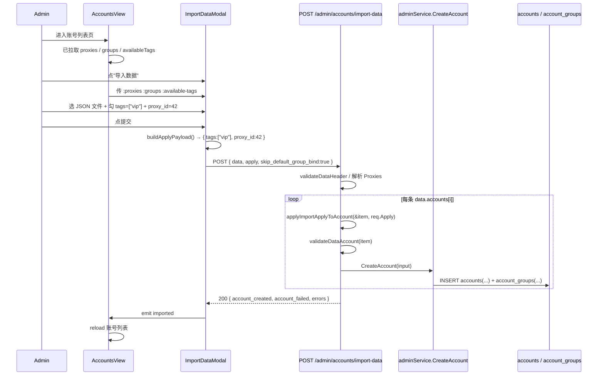

# 账号导入"应用字段"功能 design

## 0. 术语约定

| 术语 | 定义 | 防冲突结论 |
|---|---|---|
| 导入应用块 / Import Apply | 账号导入弹窗里"勾选即覆盖"的可选字段集合，含 6 个字段（tags / group_ids / proxy_id / concurrency / priority / model_mapping）。后端字段名 `Apply *DataImportApply`，前端字段名 `apply: DataImportApply`。 | 全项目 grep `ImportApply`、`DataImportApply`、`ApplyOverrides`、`import_apply`、`apply_to_all`，仅 `backend/internal/service/gemini_quota.go` 出现过 `apply_to_all`（gemini 配额场景的"是否应用到全部"flag），与本 feature 维度无关。新引入的标识符独占。 |
| 应用 / Apply（动词） | "把 UI 里勾选的字段值覆盖到文件里所有账号项的同名字段"这一行为。**显式不用 "override" 字眼**——`channelMonitor` 已有 `BodyOverrideMode / body_override`（请求体覆盖语义），混用会让后人读到时反复确认这两套是不是同一回事。本 feature 沿用 `BulkEditAccountModal` 的 "apply" 命名口径。 | grep `frontend/src/api/admin/channelMonitor.ts:10-83` 确认 `BodyOverrideMode` 是 channel monitor 模块的请求体覆盖；本 feature 不复用、不重名、不混用。 |
| 启用标志 / enable flag | UI 上每个字段前的 checkbox。`enable=true` 表示"该字段会作为 Apply 块的一部分发到后端"；`enable=false` 时该字段从 payload 里整体省略。语义和 `BulkEditAccountModal.vue` 的 `enableXxx` 完全对齐。 | 不引入新 schema 概念，仅前端表单状态。 |
| 文件原值 vs UI 应用值 | 文件原值 = 用户上传 JSON 的 `data.accounts[i]` 上原本就有的字段；UI 应用值 = 用户在弹窗里启用并填写的 Apply 字段。本 feature 唯一的合并语义：**Apply 启用 → 覆盖；Apply 未启用 → 保留文件原值**。不存在第三种"仅当文件为空时填默认"语义（用户已确认）。 | 已在第 1.1 节锁死，本 feature 不留模糊空间。 |
| DataAccount 扩展字段 | 本 feature 给 `DataAccount`（`backend/internal/handler/admin/account_data.go:46`）追加两个字段：`Tags []string \`json:"tags,omitempty"\``、`GroupIDs []int64 \`json:"group_ids,omitempty"\``。其余 4 字段（concurrency / priority / proxy_key / credentials.model_mapping）已存在。 | grep `backend/internal/handler/admin/account_data.go` 现有字段，无 `tags` / `group_ids` 字段。新增字段名与同文件其他字段不冲突。 |

防冲突 grep 命令与命中清单：

- `rg -i "ImportApply|DataImportApply|ApplyOverrides|import_overrides|import_apply|apply_to_all" backend/ frontend/src/` → 仅命中 `backend/internal/service/gemini_quota.go` 一处，无关
- `rg -i "Override|override" frontend/src/api/admin/channelMonitor.ts` → 命中 `BodyOverrideMode / body_override_mode / body_override`，确认为 channel monitor 已有概念，本 feature 避开 "override" 字眼
- `rg -n "tags|group_ids" backend/internal/handler/admin/account_data.go` → 当前 `DataAccount` 上无这两个字段，可安全新增

## 1. 决策与约束

### 1.1 需求摘要

**做什么**：在账号管理"导入数据"弹窗（`frontend/src/components/admin/account/ImportDataModal.vue`）里，文件选择框下方增加 6 个可选字段（标签 / 模型选择 / 代理 / 并发数 / 优先级 / 分组）。每个字段配一个启用 checkbox。用户勾选并填值后点"导入"，前端把这 6 个字段打包为 `apply` 块和 JSON 文件一起发给后端；后端在循环 `data.accounts` 入库时，对每条 account 应用 Apply 块——勾选了的字段覆盖文件原值，未勾选的字段保留文件原值。

**为谁**：仅 admin 角色（账号管理本身只对 admin 暴露）。普通用户、API 调用方、调度器、计费链路完全不感知。

**成功标准**（每条都可独立验证）：

1. 上传一份含 N 条账号的 JSON 文件，UI 不勾选任何 Apply 字段，导入完成后这 N 条账号入库的 6 个字段值 = 文件 `data.accounts[i]` 的对应字段值（`tags` / `group_ids` 缺省时入库为 `[]` / 空绑定，与现有行为一致）
2. UI 仅勾选 `tags`，填 `["vip","prod"]`，导入完成后这 N 条账号 `tags` 字段全部为 `["vip","prod"]`，其余 5 个字段沿用文件原值
3. UI 勾选 `proxy` 选已有代理 ID=42，文件里 `proxy_key` 指向另一条代理，导入后 N 条账号 `proxy_id` 全部为 42（UI 覆盖文件）
4. UI 勾选 `concurrency=10`、`priority=1`，文件里这两个字段是 3 / 50，导入后 N 条账号 `concurrency=10`、`priority=1`
5. UI 勾选 `model_mapping`（白名单模式选 `claude-3-5-sonnet`），导入后 N 条账号 `credentials.model_mapping` = `{"claude-3-5-sonnet":"claude-3-5-sonnet"}`，覆盖文件里原有的 `credentials.model_mapping`
6. UI 勾选 `groups=[5,7]`，导入后 N 条账号都通过 `account_groups` 中间表绑定到分组 5 和 7
7. 旧版导出文件（`DataAccount` 不含 `tags` / `group_ids` 字段）能成功解析并导入，行为与现状一致（向后兼容）
8. 新版 export 接口（`GET /api/v1/admin/accounts/export-data`）返回的 `DataAccount` 含 `tags` 和 `group_ids` 字段；用同一文件导入到另一环境，账号的标签和分组与原环境一致（导出/导入对称）

**明确不做**（每条都能 grep 反向核对）：

- 不做"逐行差异化设置"——Apply 块对**所有**导入账号统一应用；不会有"第 1 条账号 tags=A、第 2 条 tags=B"的 UI（如果需要差异化，请用户在导出文件里直接编辑）
- 不做"导入预览页面"（先解析展示再确认）——导入仍是一次性提交，不增加交互步骤
- 不做"仅当文件为空时填默认值"语义（用户已拒绝）——只有"勾选即覆盖"和"未勾选保留原值"两种状态
- 不做 Apply 块的"追加 / 移除"语义——勾选 `tags` 永远是"全量替换为 UI 列表"，不是"在文件原 tags 上追加 UI 列表"
- 不动 `service.CreateAccountInput` / `service.CreateAccount` 函数签名——这些已有的 6 个字段入参直接复用，本 feature 仅在 handler 层做"Apply → DataAccount 字段覆盖"
- 不动 `account_groups` 中间表 schema、不动 `accounts.tags` 字段 schema、不动 `proxies` schema——本 feature 是纯 handler / DTO / UI 层改动
- 不动账号导出接口 `ExportData` 的 query 参数和路由
- 不引入"导入历史 / 导入审计"日志（后续 feature）
- 不在普通用户可见的 `/api/v1/channels/available` 等接口暴露 Apply 块或 `tags` / `group_ids` 字段（本 feature 在 admin 路由内）

### 1.2 关键决策

| 决策 | 候选 | 拍板 | 被拒理由 |
|---|---|---|---|
| 字段命名空间 | (a) `apply`（沿用 BulkEdit 口径） (b) `overrides` (c) `defaults` | (a) `apply` | (b) 与 `channelMonitor.BodyOverrideMode` 概念混淆；(c) "defaults" 暗示"仅文件为空时填"语义，与用户拍板的"勾选即覆盖"相反 |
| Apply 块结构 | (a) 6 字段都用指针/可选区分"未应用"和"显式空" (b) Apply 块每个字段都带 `enabled: bool` 兄弟字段 | (a) 指针/可选 | 后端已有 `BulkUpdateAccountsInput.Tags *[]string` 模式可参考，简洁。前端的 enable checkbox 仅作 UI 状态，构造 payload 时 enable=false 直接省略字段，后端不需要额外的 enabled 标志 |
| Proxy 应用方式 | (a) UI 选 proxy_id 直接覆盖每条 account.proxy_id（绕开文件 proxy_key 流程） (b) UI 也用 proxy_key 字符串 | (a) proxy_id | UI 用户选的是已有代理实体，proxy_id 直接、明确；走 proxy_key 还要反查 / 重建，多此一举 |
| Model 应用方式 | (a) Apply 块顶层加 `model_mapping: map[string]string`，后端写到每条 account.credentials.model_mapping (b) UI 直接编辑文件里 credentials | (a) | 与 BulkEdit 口径完全一致（`buildModelMappingObject` 复用），用户认知一致 |
| 模型选择支持模式 | (a) 白名单 + 映射两种（与 BulkEdit 一致） (b) 仅白名单 | (a) | 复用 `ModelWhitelistSelector`、`buildModelMappingObject` 不增成本，且和单账号编辑、批量编辑入口体验一致；只支持一种会让用户疑惑 |
| DataAccount 兼容性 | (a) 新增 `tags` / `group_ids` 字段都用 `omitempty`，旧文件不带不报错 (b) 强制要求新文件带 | (a) | 已经有用户在生产用旧版导出文件，强制升级风险大；`omitempty` 是低成本兼容 |
| Apply 应用时机 | (a) 在 handler `importData` 循环里，先把 Apply 字段合并到 DataAccount，再走原有 `CreateAccountInput` 构造 (b) 在 service 层 `CreateAccount` 增加 Apply 入参 | (a) | service 层不应感知"导入"概念，Apply 是 handler 维度的需求；service 保持单职责 |
| UI 字段是否折叠 | (a) 默认折叠成"高级选项"，点开展开 (b) 默认全部展开 | (a) 折叠 | 文件选择本身是导入弹窗的核心动作，6 个 Apply 字段是"可选增强"，默认展开会让弹窗很高、视觉重点偏离；折叠后老用户行为完全不变 |

**未拍板但已写为假设**（用户在 review 时反驳）：

- 假设 1：`groups` 字段（Apply 块的 `group_ids`）启用时**绝对覆盖**——即使文件里 `data.accounts[i].group_ids = [3]`，UI 选了 `[5,7]`，最终入库分组 = `[5,7]`（不是 `[3,5,7]` 取并集）。语义和 BulkEdit 的"绑定关系替换"一致。如果你期望"取并集"或"在文件分组基础上加 UI 分组"，这是另一种语义，需要明确反驳。
- 假设 2：`tags` 启用且填空数组（用户勾了 tags 但没填任何标签）→ 显式把所有导入账号的 tags 设为 `[]`（清空语义）。如果不想支持"显式清空"，可以约束 UI"启用 tags 时至少填 1 个"。我倾向支持显式清空——和 BulkEdit 一致。
- 假设 3：UI 上 6 个字段统一放在文件选择框下方一个"应用到所有账号（可选）"折叠面板里，默认折叠。展开后内部按 BulkEdit 的视觉风格组织（每字段一行：label + checkbox + 控件）。如果你希望默认展开、或希望按"账号通用 / 模型 / 代理"分组，请反驳。
- 假设 4：单账号导入失败（如分组 ID 不存在 / proxy_id 不存在）时，整体导入不中止，按当前 `importData` 错误处理逻辑——把错误条记到 `result.errors`，`account_failed++`，继续下一条。Apply 字段引发的错误归到对应账号的错误条里。
- 假设 5：导入文件里**含 `proxies` 数组**时，仍按现有逻辑处理（先建/复用代理，再用 `proxy_key` 反查 ID）；UI 启用了 proxy 时，**Apply 块的 proxy_id 优先于文件 proxy_key**（覆盖每条 account.ProxyKey 的查询结果）。文件的 `proxies` 数组不被忽略，因为里面的代理可能给"未启用 Apply.proxy"的导入场景使用。

### 1.3 主流程概述

**正常路径**（用户启用了若干 Apply 字段）：

```
用户在弹窗选 JSON 文件 + 勾选 tags=["vip"] + concurrency=10
                    ↓
前端 ImportDataModal handleImport：
    解析文件为 dataPayload
    构造 apply = { tags: ["vip"], concurrency: 10 }
    POST /api/v1/admin/accounts/import-data { data, apply, skip_default_group_bind }
                    ↓
后端 ImportData handler：
    bind 请求体 → DataImportRequest{Data, Apply, ...}
    validateDataHeader(req.Data)
    importData(ctx, req)
                    ↓
importData 循环 dataPayload.Accounts：
    for each account in dataPayload.Accounts:
        applyImportApplyToAccount(&account, req.Apply)  ← 新增：把 Apply 字段覆盖到 account
        validateDataAccount(account)
        构造 CreateAccountInput（沿用现有逻辑）
        adminService.CreateAccount(...)
                    ↓
返回 DataImportResult { account_created, account_failed, errors, ... }
```

**关键异常路径**：

- 文件解析失败 → 前端 `appStore.showError(dataImportParseFailed)`，不发请求
- Apply 块 `proxy_id` 指向不存在的代理 → 后端 `applyImportApplyToAccount` 不报错（仅赋值），后续 `CreateAccount` 调用时 service 层校验失败，错误记到该账号的 `errors` 条
- Apply 块 `group_ids` 含不存在的分组 ID → 同上，service 层校验失败，记到该账号 `errors`
- Apply 块 `tags` 超长 / 数量超限 → service 层 `NormalizeAccountTags` 拒绝，记到该账号 `errors`
- 文件里 `data.accounts[i]` 缺 name / platform / type / credentials → 现有 `validateDataAccount` 拒绝，记到 `errors`
- 旧版文件不带 `tags` / `group_ids` → JSON 解析为零值（nil / nil），与 Apply 未启用时行为一致，向后兼容

### 1.4 模块归属

本 feature 放在 **accounts 模块的导入子能力** 内扩展，不新建独立模块。

理由：

- 账号导入本来就由 `backend/internal/handler/admin/account_data.go`（650 行）独立承担，本 feature 是"导入"这个已有职责的自然延伸——给入参加可选块、给数据结构加可选字段、给循环加 helper 调用
- 前端 `frontend/src/components/admin/account/ImportDataModal.vue`（205 行）专司导入弹窗，扩展 6 字段属于已有职责的内聚增强
- 复用控件全部在 `frontend/src/components/account/` 和 `frontend/src/components/common/`（`AccountTagsInput` / `ModelWhitelistSelector` / `ProxySelector` / `GroupSelector`）已经存在，不需要新建
- 不涉及调度、计费、权限、API key 等其他子系统的链路

不新建模块。前端文件结构、后端 handler 包结构都不动。

## 2. 接口契约

### 2.1 后端 API

#### 2.1.1 `DataAccount` 增加可选字段（向后兼容）

```go
// 来源：backend/internal/handler/admin/account_data.go DataAccount（追加 2 个字段）
type DataAccount struct {
    Name               string         `json:"name"`
    Notes              *string        `json:"notes,omitempty"`
    Platform           string         `json:"platform"`
    Type               string         `json:"type"`
    Credentials        map[string]any `json:"credentials"`
    Extra              map[string]any `json:"extra,omitempty"`
    ProxyKey           *string        `json:"proxy_key,omitempty"`
    Concurrency        int            `json:"concurrency"`
    Priority           int            `json:"priority"`
    RateMultiplier     *float64       `json:"rate_multiplier,omitempty"`
    ExpiresAt          *int64         `json:"expires_at,omitempty"`
    AutoPauseOnExpired *bool          `json:"auto_pause_on_expired,omitempty"`

    // 新增：管理员标签集合，规范化由 service.NormalizeAccountTags 负责
    Tags []string `json:"tags,omitempty"`
    // 新增：分组 ID 列表（导入时希望该账号绑定到哪些分组）
    GroupIDs []int64 `json:"group_ids,omitempty"`
}
```

`omitempty` 保证旧版导出文件（不带这两个字段）解析时为 nil，与现有行为完全一致。

#### 2.1.2 `DataImportRequest` 增加可选 `Apply` 块

```go
// 来源：backend/internal/handler/admin/account_data.go DataImportRequest（追加 Apply 字段）
type DataImportRequest struct {
    Data                 DataPayload      `json:"data"`
    SkipDefaultGroupBind *bool            `json:"skip_default_group_bind"`

    // 新增：导入应用块。nil 或全字段 nil → 行为等价当前。
    // 任一字段非 nil → 该字段值会"覆盖"循环里每条 account 对应字段。
    Apply *DataImportApply `json:"apply,omitempty"`
}

// 来源：backend/internal/handler/admin/account_data.go DataImportApply（新增 struct）
type DataImportApply struct {
    Tags         *[]string          `json:"tags,omitempty"`          // nil 不应用；[] 显式清空；非空 全量替换
    GroupIDs     *[]int64           `json:"group_ids,omitempty"`     // nil 不应用；[] 显式不绑任何分组
    ProxyID      *int64             `json:"proxy_id,omitempty"`      // nil 不应用；0 显式清除代理；>0 设代理
    Concurrency  *int               `json:"concurrency,omitempty"`   // nil 不应用
    Priority     *int               `json:"priority,omitempty"`      // nil 不应用
    ModelMapping *map[string]string `json:"model_mapping,omitempty"` // nil 不应用；{} 显式清空白名单/映射
}
```

指针/可选语义对照表（每个字段三态）：

| 字段值状态 | 含义 |
|---|---|
| 字段在 JSON 里整体省略（指针 nil） | "未启用 Apply" → 保留文件原值 |
| 字段为 `null` / `[]` / `{}` / `0`（视字段类型） | "启用 Apply 且显式清空 / 清除"（仅 `Concurrency` / `Priority` 例外，见下） |
| 字段为非空具体值 | "启用 Apply 且覆盖" |

`Concurrency` / `Priority` 例外说明：这两个字段后端 schema 默认值分别是 3 和 50，且 service 层不接受 0/负数（已有行为）。前端 UI 数字输入框会校验 ≥ 1，所以 `*Concurrency = 0` 实际不会出现。如果出现按"启用 Apply 但值无效" 处理，落到 service 校验时报 `"concurrency must be >= 0"`（但本 feature 不引入这个错误路径——前端拦住）。

#### 2.1.3 导入接口请求/响应示例

```jsonc
// POST /api/v1/admin/accounts/import-data
// 来源：backend/internal/handler/admin/account_data.go (h *AccountHandler) ImportData

// 请求示例（启用 tags + priority + proxy_id 三个字段）
{
  "data": {
    "type": "sub2api-data",
    "version": 1,
    "exported_at": "2026-05-06T10:00:00Z",
    "proxies": [],
    "accounts": [
      { "name": "acc-1", "platform": "anthropic", "type": "oauth",
        "credentials": {"access_token":"..."}, "concurrency": 3, "priority": 50 },
      { "name": "acc-2", "platform": "anthropic", "type": "oauth",
        "credentials": {"access_token":"..."}, "concurrency": 5, "priority": 10,
        "tags": ["legacy"] }
    ]
  },
  "apply": {
    "tags": ["vip", "prod"],
    "priority": 1,
    "proxy_id": 42
  },
  "skip_default_group_bind": true
}

// 200 OK
{
  "account_created": 2,
  "account_failed":  0,
  "proxy_created":   0,
  "proxy_reused":    0,
  "proxy_failed":    0
}

// 入库结果（acc-1 / acc-2 同时被 apply）：
//   acc-1.tags=["prod","vip"]、priority=1、proxy_id=42、concurrency=3（文件原值）
//   acc-2.tags=["prod","vip"]、priority=1、proxy_id=42、concurrency=5（文件原值）
//   注意 acc-2 文件原 tags=["legacy"] 被 Apply 完全覆盖
```

```jsonc
// 不启用任何 Apply 字段（兼容现有行为）
{
  "data": { /* 同上 */ },
  "skip_default_group_bind": true
}

// 等价于
{
  "data": { /* 同上 */ },
  "apply": null,
  "skip_default_group_bind": true
}

// 也等价于
{
  "data": { /* 同上 */ },
  "apply": {},
  "skip_default_group_bind": true
}
```

```jsonc
// 错误路径：Apply 块指向不存在的代理 ID
{
  "data": { "accounts": [{ "name": "acc-x", "platform": "anthropic", "type": "oauth",
      "credentials": {"access_token":"..."}, "concurrency": 3, "priority": 50 }] },
  "apply": { "proxy_id": 999999 }
}

// 200 OK（HTTP 层成功，单条账号失败）
{
  "account_created": 0,
  "account_failed":  1,
  "errors": [
    { "kind": "account", "name": "acc-x", "message": "proxy not found: 999999" }
  ]
}
```

#### 2.1.4 `ExportData` 同步导出新字段

```go
// 来源：backend/internal/handler/admin/account_data.go (h *AccountHandler) ExportData
// 仅在构造 dataAccounts 处追加 Tags / GroupIDs（其余逻辑不变）
dataAccounts = append(dataAccounts, DataAccount{
    Name:               acc.Name,
    // ... 既有字段 ...
    Tags:               acc.Tags,                    // 新增
    GroupIDs:           collectGroupIDs(acc.Groups), // 新增；helper 从 service.Account.Groups 抽 ID
})
```

`collectGroupIDs` 是 `account_data.go` 内部新增的小函数，不暴露给 service / repo。

```jsonc
// GET /api/v1/admin/accounts/export-data 响应示例（同环境导出）
{
  "exported_at": "2026-05-06T10:00:00Z",
  "proxies": [...],
  "accounts": [
    { "name": "acc-1", "platform": "anthropic", "type": "oauth",
      "credentials": {"access_token":"..."}, "concurrency": 3, "priority": 50,
      "tags": ["prod","vip"], "group_ids": [5, 7] }
  ]
}
```

旧版客户端（不识别新字段）忽略这两个字段，行为与之前完全一致。

### 2.2 前端组件

#### 2.2.1 组件拆分

```
AccountsView.vue（已存在，1652 行）
└── ImportDataModal.vue（已存在，205 行 → 扩展后 ~500 行）
    ├── ProxySelector.vue（已存在，复用）
    ├── GroupSelector.vue（已存在，复用）
    ├── AccountTagsInput.vue（已存在，复用）
    └── ModelWhitelistSelector.vue（已存在，复用）
```

**不新建子组件**。理由：

- 6 个字段的 UI 已全部由 `frontend/src/components/account/BulkEditAccountModal.vue` 解决，其控件（`ProxySelector / GroupSelector / AccountTagsInput / ModelWhitelistSelector`）都是可独立复用的纯受控组件
- 抽出"ImportApplyForm"子组件只在两处使用（导入弹窗 / 批量编辑弹窗）会有合并收益，但当前 BulkEdit 已经把这套 UI 内嵌得很深、和它自己的"启用 checkbox + 字段值"强绑定，强行抽出共用反而会破坏 BulkEdit 现状
- ImportDataModal 扩展后约 500 行，仍在项目可接受范围（BulkEdit 1799 行没拆）

如果未来发现"导入弹窗"和"批量编辑弹窗"的 Apply 表单出现重复维护成本，再独立起 feature 抽 `<AccountFieldApplyForm>` 组件，本 feature 不做。

#### 2.2.2 `ImportDataModal.vue` Props / Events 变更

```vue
<!-- 来源：frontend/src/components/admin/account/ImportDataModal.vue（扩展） -->

<!-- 新增 Props（AccountsView 传入）-->
<ImportDataModal
  :show="showImportData"
  :proxies="proxies"          <!-- 新增：来自 AccountsView 现有 ref -->
  :groups="groups"            <!-- 新增：同上 -->
  :available-tags="availableTags"  <!-- 新增：同上 -->
  @close="showImportData = false"
  @imported="handleDataImported"
/>

<!-- 新增内部状态（仅此弹窗持有）-->
<!-- enableTags / enableGroups / enableProxy / enableConcurrency / enablePriority / enableModelRestriction：6 个 boolean，初始 false -->
<!-- applyTags: string[] / applyGroupIds: number[] / applyProxyId: number|null / applyConcurrency: number / applyPriority: number -->
<!-- modelRestrictionMode: 'whitelist'|'mapping' / allowedModels: string[] / modelMappings: {from,to}[] -->

<!-- Events 不变：close / imported -->
```

#### 2.2.3 关键交互路径

```
（场景 1：勾选 tags + priority）
用户点"导入"按钮 → 弹窗打开（默认折叠 Apply 面板）
   ↓
用户点击"应用到所有账号（可选）"标题 → 面板展开
   ↓
用户勾选 tags 复选框 → AccountTagsInput 输入"vip" 回车 → applyTags=["vip"]
用户勾选 priority 复选框 → 数字框填 1 → applyPriority=1
   ↓
用户选择 JSON 文件 → file=<File>
   ↓
用户点提交 → buildApplyPayload() 只把 enable=true 的字段塞进 apply 对象
   ↓
POST /admin/accounts/import-data { data, apply: { tags:["vip"], priority:1 } }
```

```
（场景 2：不展开 Apply 面板，直接导入——完全等价旧行为）
用户点"导入"按钮 → 弹窗打开
   ↓
用户选择 JSON 文件 → file=<File>
   ↓
用户点提交 → buildApplyPayload() 返回 undefined（没勾选任何字段）
   ↓
POST /admin/accounts/import-data { data, skip_default_group_bind: true }
   （不带 apply 字段，等价当前行为）
```

#### 2.2.4 状态归属

| 状态 | 归属 | 备注 |
|---|---|---|
| `proxies` / `groups` / `availableTags` 候选数据 | `AccountsView.vue`（已有）通过 props 传给 `ImportDataModal` | 复用 AccountsView 现有的拉取逻辑，不重复请求 |
| 6 个 enable 标志 + 字段值 | `ImportDataModal.vue` 内部 ref | 弹窗关闭时全部 reset（沿用现有 `watch(props.show)` 重置模式） |
| 文件对象 / result / errorItems | `ImportDataModal.vue` 内部 ref（已有） | 不变 |

把候选数据放在 `AccountsView` 的原因：AccountsView 已经在拉这些数据（用于创建/编辑/批量编辑弹窗），没必要在导入弹窗里再拉一份。这是项目已有的传值模式（参考 `<CreateAccountModal :proxies :groups />`、`<BulkEditAccountModal :proxies :groups />`）。

### 2.3 主流程 Mermaid



## 3. 实现提示

### 3.1 改动计划

#### 3.1.1 后端

| 文件 | 类型 | 改动摘要 |
|---|---|---|
| `backend/internal/handler/admin/account_data.go` | 追加到已有文件 | (1) `DataAccount` 加 `Tags` / `GroupIDs` 字段（`omitempty`）；(2) 新增 `DataImportApply` struct；(3) `DataImportRequest` 加 `Apply *DataImportApply`；(4) 新增 helper `applyImportApplyToAccount(item *DataAccount, apply *DataImportApply) (resolvedProxyID *int64)`，把 Apply 字段覆盖到 item 上，proxy_id 通过返回值传出；(5) `importData` 循环里在 `validateDataAccount` 之前调用该 helper；(6) `ExportData` 构造 `DataAccount` 时填 `Tags` / `GroupIDs`；(7) 新增 `collectGroupIDs(groups []service.AccountGroup) []int64` helper |
| `backend/internal/service/admin_service.go` | 不动 | `CreateAccountInput` 已有所需 6 字段入参，handler 把 Apply 合并到 DataAccount 后照常构造 input 即可；不改 service 层 |
| `backend/internal/handler/admin/account_data_apply_test.go` | 新建 | helper 单测：6 字段各自 nil/非 nil 行为；ModelMapping 写入 credentials 不破坏其他键；Apply==nil 直接 return |
| `backend/internal/handler/admin/account_data_handler_test.go` | 追加 | 整链路用例：Apply.Tags 覆盖；Apply.GroupIDs 覆盖；Apply.ProxyID 优先于文件 ProxyKey；Apply.Concurrency / Priority 覆盖；Apply.ModelMapping 写到 credentials；Apply==nil 行为等价旧版；旧版文件（无 tags/group_ids）+ Apply 启用 tags 兼容 |

涉及导出对称：

- `service.Account` 已含 `Tags []string`（feature 2026-05-04-account-tags 加的）和 `Groups []service.AccountGroup`（已有）
- `ExportData` 当前 `resolveExportAccounts` 走 `adminService.ListAccounts` 或 `GetAccountsByIDs`——验收阶段需要确认这两个路径都 preload 了 `Groups`（如果没有，service 层补一次预加载，或 ExportData handler 内部再 fetch 一次）。这是验收检查项

#### 3.1.2 前端

| 文件 | 类型 | 改动摘要 |
|---|---|---|
| `frontend/src/components/admin/account/ImportDataModal.vue` | 追加到已有文件（205 → ~500 行） | (1) Props 加 `proxies` / `groups` / `availableTags`；(2) script 加 6 个 `enableXxx` ref + 字段值 ref + `modelRestrictionMode` / `allowedModels` / `modelMappings`；(3) template 在文件选择框下方加一个 `<details>` 折叠面板，标题 i18n `admin.accounts.dataImportApplyTitle`，内部按 BulkEdit 视觉风格组织 6 行；(4) `handleImport` 之前调 `buildApplyPayload()` 构造 apply 块，只把 enable=true 的字段塞进对象；(5) `watch(props.show)` 关闭时 reset 所有新增 state |
| `frontend/src/views/admin/AccountsView.vue` | 追加 | 第 331 行 `<ImportDataModal>` 标签上加 `:proxies="proxies" :groups="groups" :available-tags="availableTags"`（这三个 ref 已存在） |
| `frontend/src/types/index.ts` | 追加 | 扩展 `AdminDataImportRequest`（如已有则扩展）加 `apply?: DataImportApply`；新增 `DataImportApply` 接口 |
| `frontend/src/api/admin/accounts.ts` | 不动或微调 | `importData` 已经接受 `DataImportRequest`，扩展类型即可；如果当前是 `data: any` 则升级类型 |
| `frontend/src/i18n/locales/*.{json,ts}` | 追加 | 加 `admin.accounts.dataImportApplyTitle / dataImportApplyHint / dataImportApplyTags / ...modelRestriction / ...proxy / ...concurrency / ...priority / ...groups` 等词条；中英文同步 |
| `frontend/src/__tests__/integration/data-import.spec.ts` | 追加用例 | 沿用现有 mock 模式，新增 case：(1) 不勾选任何字段 → 提交 payload 不含 apply；(2) 勾选 tags 并填值 → payload.apply.tags 正确；(3) 勾选 proxy_id → payload.apply.proxy_id 正确；(4) 关闭弹窗后 enable 状态被 reset；(5) 默认 Apply 面板折叠 |

### 3.2 实现风险与约束

1. **不要把 Apply 应用逻辑混进 `validateDataAccount`**——validate 是只读校验，applyImportApplyToAccount 是会改 item 的写动作。两个动作分开调用，否则后人 review 会以为校验函数有副作用。helper 命名上 `apply...ToAccount` 已经明确表达"会改 account"。

2. **`Apply.GroupIDs` 启用时要绕过 `skip_default_group_bind` 行为**——现状是 `SkipDefaultGroupBind=true`，account 不会被绑到平台默认分组。Apply.GroupIDs 启用时直接覆盖每条 account 的 GroupIDs 入参（在 handler 把它塞进 `CreateAccountInput.GroupIDs`），让 service 层按"非空 GroupIDs"路径走，不再跑默认分组逻辑。**约束**：当 Apply.GroupIDs 是 `[]`（显式空数组）时，等价"不绑任何分组"，仍保持 SkipDefaultGroupBind=true（不要因为 `len(GroupIDs)==0` 就退化到默认分组）。

3. **`Apply.ProxyID` 优先级高于文件 `ProxyKey`**——helper 收到 Apply.ProxyID != nil 时通过返回值传出 resolvedProxyID；handler 循环里如果 helper 返回非 nil 就用它构造 `CreateAccountInput.ProxyID`，并且**不再走** `proxyKeyToID[*item.ProxyKey]` 这条原有路径。文件里的 `proxies` 数组仍正常解析建/复用代理（不忽略，因为可能给"未启用 Apply.proxy"的导入场景使用——见假设 5）。

4. **`Apply.ModelMapping` 写到 credentials 的方式必须保留 credentials 其他键**——helper 实现 `item.Credentials["model_mapping"] = *apply.ModelMapping`，**不要** 用 `item.Credentials = map[string]any{"model_mapping": ...}` 这种整体替换写法（会丢 access_token / api_key 等核心字段）。helper 还要兼容 `item.Credentials == nil` 的情况——先 `item.Credentials = map[string]any{}` 再赋值。

5. **前端 `buildApplyPayload()` 要彻底跳过未启用字段**——payload 里 "未启用" 必须是 "字段不存在"，不能是 "字段存在但值为 null/0/[]"。后端按指针非 nil 判定是否应用，前端如果发 `tags: null` 后端解析为 `*[]string` 的 nil 等价不应用——这部分行为吻合，但**显式空字段** 必须靠用户主动启用 + 留空控件，不能误把用户没勾的字段以默认值发出去。

6. **i18n 词条不带 emoji**（项目级输出规范）——所有新增文案中文 ASCII，错误码用全大写常量（本 feature 主要不引入新错误码）。

7. **类型一致性**：前端 `applyProxyId` 可能是 `number | null`，但语义上 `null` 不要发送；只有用户主动选 "清除代理"（proxy_id=0）时才发 `proxy_id: 0`。如果 ProxySelector 的 v-model 绑定的 ref 没选时是 null，前端 buildApplyPayload 把 null → 不发送（即使 enableProxy=true）。这一点需要 i18n 提示用户"启用代理但未选时本字段不会应用"。

8. **DataAccount 字段顺序**：新增的 `Tags` / `GroupIDs` 放在 struct 末尾，不要插在中间——避免 git diff 被误读为整段重写。

9. **后端 Apply 默认值兼容**：`req.Apply == nil` 和 `req.Apply != nil && req.Apply.<all-fields>==nil` 必须等价。helper 第一行先 `if apply == nil { return nil }`，第二层 if 检查每个字段 nil。整链路用例 `TestImportData_NilApply_BehavesLikeBefore` 必须通过。

10. **`ExportData` 的 Groups 预加载**：验收阶段需要确认 `ListAccounts` / `GetAccountsByIDs` 都返回了 `Groups` 字段。如果没有，需要 service 层补预加载或 handler 内部 fetch。**这是潜在的隐藏依赖**——如果当前 service 没预加载，本 feature 实现时要顺带补上（属于本 feature 范围）。

### 3.3 推进顺序

按"功能可见度"组织。每一步可独立验证，前 2 步纯后端、3-5 步纯前端，可以分开 commit。

| # | 推进步骤 | 退出信号 |
|---|---|---|
| 1 | **后端 DataAccount 扩展 + ExportData 同步** —— `DataAccount` 加 `Tags` / `GroupIDs`（`omitempty`）；`collectGroupIDs` helper；`ExportData` 构造时填两字段；如发现 ExportData 路径没预加载 Groups，补预加载 | 单测 `account_data_handler_test.go` 中 `TestExportData_IncludesTagsAndGroupIDs` 用例通过；旧版导入文件（不带这两字段）解析为零值，`importData` 行为不变（已有用例继续过） |
| 2 | **后端 DataImportApply struct + helper + importData 接入** —— 新增 `DataImportApply` / `DataImportRequest.Apply` / `applyImportApplyToAccount` helper；`importData` 循环里在 validate 之前调用 helper；helper 单测 + 整链路用例 | `go test ./backend/internal/handler/admin/...` 全绿；helper 单测 6 字段 case 覆盖；整链路 `TestImportData_NilApply_BehavesLikeBefore` 通过；`TestImportData_LegacyFileWithoutTags_ApplyTagsWorks` 通过 |
| 3 | **AccountsView 给 ImportDataModal 传 props** —— `<ImportDataModal :proxies :groups :available-tags>` | `pnpm vitest run AccountsView` 既有用例不退；浏览器打开导入弹窗，开发者工具检查弹窗 props 含三个新字段（虽然 UI 还没用上） |
| 4 | **ImportDataModal UI 加折叠面板 + 6 字段控件** —— template 加 `<details>` + 6 行（每行 enable + 控件）；script 加 ref + buildApplyPayload；watch reset；i18n 词条 | 浏览器：勾选 tags 输入 "vip" 提交；开发者工具 Network 面板里 POST 请求 body 含 `apply.tags=["vip"]`；不勾选时 body 不含 apply 字段 |
| 5 | **测试补全 + 端到端联调** —— `data-import.spec.ts` 加新用例；端到端在浏览器里跑 6 字段全启用一次 | `pnpm vitest run` + `go test ./backend/...` 全绿；浏览器：上传含 3 条账号的 JSON，启用 tags=["t1"] / proxy_id=42 / priority=1 / groups=[5,7]，导入完成后这 3 条账号的字段值符合成功标准 1-6 |

5 步，每步都能独立验证。

### 3.4 测试设计

| 功能点 | 测试约束 | 验证方式 | 关键用例骨架 |
|---|---|---|---|
| `applyImportApplyToAccount` helper 行为 | 6 字段各自 nil/非 nil 时正确覆盖；ModelMapping 写入 credentials 不破坏其他键；Apply==nil 直接 return；Credentials==nil 时 helper 安全初始化 | `backend/internal/handler/admin/account_data_apply_test.go`（新建，build tag `unit`） | `TestApplyImportApply_NilApply_NoOp` / `TestApplyImportApply_Tags_Overrides` / `TestApplyImportApply_GroupIDs_OverridesEmptyArray` / `TestApplyImportApply_ProxyID_ReturnsResolvedID` / `TestApplyImportApply_ConcurrencyPriority` / `TestApplyImportApply_ModelMapping_PreservesOtherCredentials` / `TestApplyImportApply_NilCredentials_InitializesMap` |
| `importData` 整链路（含 Apply） | 启用 tags + groups + proxy_id 后入库结果符合成功标准 1-6；旧文件 + Apply 启用 tags 兼容；Apply==nil 行为等价旧版 | `backend/internal/handler/admin/account_data_handler_test.go`（追加） | `TestImportData_ApplyTags_AllAccountsTagged` / `TestImportData_ApplyProxyID_OverridesFileProxyKey` / `TestImportData_ApplyGroupIDs_BindsToGroups` / `TestImportData_LegacyFileWithoutTags_ApplyTagsWorks` / `TestImportData_NilApply_BehavesLikeBefore` |
| `ExportData` 含 tags / group_ids | 导出的 JSON 每条 account 含两字段；空账号 tags 序列化为 `[]` 而非 `null`；group_ids 顺序稳定 | `backend/internal/handler/admin/account_data_handler_test.go`（追加） | `TestExportData_IncludesTagsAndGroupIDs` / `TestExportData_EmptyTagsSerializesAsEmptyArray` |
| 前端 ImportDataModal 折叠面板 | 默认折叠；点开后 6 行可见；6 个 enable 默认 false；关弹窗后所有 state reset | `frontend/src/__tests__/integration/data-import.spec.ts`（追加用例） | `it('默认 Apply 面板折叠')` / `it('展开后 6 行控件可见')` / `it('关闭弹窗后 enable 全部 reset')` |
| 前端 buildApplyPayload | 不勾选 → payload 不含 apply 字段；勾 tags+priority → apply 含两字段不含其他 4；勾 proxy 但选 null → apply 不含 proxy_id | `frontend/src/__tests__/integration/data-import.spec.ts`（追加用例） | `it('未勾选 → 提交 payload 不含 apply')` / `it('勾 tags+priority → payload.apply 仅含两字段')` / `it('勾 proxy 但未选代理 → apply 不含 proxy_id')` |
| 前端 6 字段提交链路 | 勾选各字段输入值后，spy `adminAPI.accounts.importData` 拿到的 payload.apply 内容正确 | `frontend/src/__tests__/integration/data-import.spec.ts`（追加用例） | `it('勾选 tags=["vip"] 提交 → API payload.apply.tags=["vip"]')` 共 6 个分别对应 6 字段 |

测试文件命名沿用项目现有约定：

- 后端单测：`*_test.go` + build tag（参考 `account_data_handler_test.go` 头部）
- 前端 spec：`.spec.ts` 用 vitest，沿用 `data-import.spec.ts` 已有 mock 模式（mock `@/stores/app` / `@/api/admin` / `vue-i18n`）

新增测试只覆盖本 feature 引入的逻辑，不补漏既有测试空白。

## 4. 与项目级架构文档的关系

**关联架构 doc**：

- `easysdd/features/2026-05-04-account-tags/account-tags-design.md` —— 账号标签 feature 已经把 `accounts.tags JSONB`、`NormalizeAccountTags`、`AccountTagsInput.vue` 落地。本 feature 直接复用这些已有产物，**不再独立设计标签维度**。本 feature 的 `DataAccount.Tags` / `Apply.Tags` / `ExportData` 输出 tags，本质上是把已有标签字段接入"导入/导出"链路。
- `easysdd/compound/2026-04-27-explore-group-account-channel-pricing.md` —— 这份 explore 描述了账号 / 分组 / 渠道定价三层关系。本 feature 不改变三层关系，只是给"导入"这条入口加可选的 Apply 块；分组绑定语义仍由 `account_groups` 中间表承担。

**架构文档补充建议**：

- `easysdd/architecture/` 下没有"账号导入"相关的架构 doc。本 feature 范围属于 handler 层的局部增强，不值得为此先补一份完整架构 doc
- `easysdd/features/2026-05-04-account-tags/account-tags-design.md` 第 1.1 节"明确不做"里"标签不参与调度"——本 feature 同样遵守，不引入任何让标签影响运行时行为的副作用
- 如果未来"导入"扩展到"批量编辑导入数据后预览再提交"或"定时自动同步外部账号"等更大范围，需要独立起 feature，并补一份 `easysdd/architecture/account-import.md`。本 feature 不预设这些扩展

**项目级 DESIGN.md / 架构总入口**：项目根目录无 DESIGN.md，导航以子目录文档为主——本 feature 不需要在根级文档加引用。


