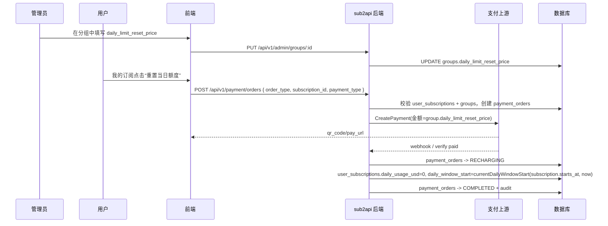

---
doc_type: feature-design
feature: 2026-05-09-daily-limit-reset-payment
status: approved
summary: 支持管理员给订阅分组配置每日额度重置价格，用户在我的订阅中付费重置当日额度
tags: [subscription, payment, group, quota, frontend]
---

# 订阅每日额度付费重置 design

## 0. 术语约定

| 术语 | 定义 | 防冲突结论 |
|---|---|---|
| 每日额度重置价格 / `daily_limit_reset_price` | 配在 `groups` 表上的人民币金额，用于用户主动重置当前订阅的日用量窗口；字段值 `nil` 或 `<=0` 表示不允许用户自助购买重置。 | 已 grep `daily_limit_reset` / `reset_price` / `OrderType`，仓库内没有同名字段；现有 `daily_limit_usd` 是 USD 用量上限，本字段是 CNY 支付金额，命名必须带 `price`，避免和 USD 用量混淆。 |
| 当日额度重置订单 / `daily_limit_reset` order type | 支付系统新增订单类型。订单金额来自订阅所属分组的 `daily_limit_reset_price`，支付成功后只清零该用户该订阅当前日窗口的 `daily_usage_usd`，并保持 `daily_window_start` 对齐该订阅的滚动 24 小时窗口起点。 | 现有 `payment.OrderTypeBalance` / `payment.OrderTypeSubscription` 只覆盖余额充值和买订阅；新增显式 order type，避免把重置伪装成余额充值或订阅续期。 |
| 目标订阅 / `subscription_id` | 用户在“我的订阅”点击按钮时要重置的 `user_subscriptions.id`。订单创建时校验此订阅属于当前用户、状态 active、未过期、关联分组为 subscription 类型且配置了日限额和重置价格。 | 现有 `plan_id` 只用于订阅套餐购买；本功能新增 `subscription_id` 入参和 `payment_orders.subscription_id` 落库，不复用 `plan_id`。 |
| 管理员重置配额 / `AdminResetQuota` | 管理后台手动重置订阅配额的已有能力，当前会禁止 `source=payment` 的订阅被管理员重置。 | 用户自助付费重置是新的业务入口，不改变管理员重置规则；实现应新增 service 方法，而不是放宽 `AdminResetQuota` 的 `SUBSCRIPTION_PAID_IMMUTABLE` 约束。 |

防冲突 grep 记录：

- `rg -n "daily_limit_reset|reset_price|OrderType" backend frontend/src easysdd`：没有已有 `daily_limit_reset` / `reset_price` 业务实现；`OrderType` 仅为 `balance` / `subscription`。
- `rg -n "ResetDailyUsage|AdminResetQuota|SUBSCRIPTION_PAID_IMMUTABLE" backend/internal/service backend/internal/handler frontend/src`：已存在后台重置能力和 repository 原子清零方法，可复用底层 `ResetDailyUsage`，但不能复用后台入口的禁止规则。
- `rg -n "daily_limit_usd|weekly_limit_usd|monthly_limit_usd" backend/internal/handler backend/internal/service frontend/src/views/admin/GroupsView.vue frontend/src/views/user/SubscriptionsView.vue`：分组限额字段贯穿 group DTO、admin group 表单、用户订阅页。

## 1. 决策与约束

### 1.1 需求摘要

**做什么**：

1. 管理员在分组设置订阅限额时，可以在“每日限额”旁配置一个“重置当日额度价格”。
2. 普通用户在“我的订阅”页看到可用订阅时，如果该订阅分组配置了日限额和重置价格，可以点击“重置当日额度”。
3. 点击后调起现有支付站/支付二维码，金额等于分组配置的重置价格。
4. 支付成功履约后，该用户该订阅当前日窗口的 `daily_usage_usd` 清零；`daily_window_start` 继续保持与订阅生效时间对齐的滚动 24 小时窗口起点，后续请求按新的当日额度继续使用。

**为谁**：

- admin：配置订阅分组的每日额度重置价格。
- user：在“我的订阅”中为自己的 active 订阅购买一次日额度重置。

**成功标准**：

1. `groups` 表新增 `daily_limit_reset_price`，后台创建/编辑分组能保存和回显该字段；未填、空值、负数都归一为 `NULL`。
2. 用户端 `GET /api/v1/subscriptions` 返回的 `group.daily_limit_reset_price` 与数据库一致。
3. `POST /api/v1/payment/orders` 传 `order_type=daily_limit_reset` 且 `subscription_id=123` 时，后端忽略前端传入的 `amount`，用目标订阅分组的 `daily_limit_reset_price` 创建订单。
4. 订单支付完成后，只重置订单所属用户和 `subscription_id` 对应订阅的日用量；不改余额、不续期、不改 weekly/monthly usage。
5. 同一个订单被 webhook / 手动 verify / admin retry 重复触发时，至多执行一次真实重置，重复触发直接补 `COMPLETED`。
6. “我的订阅”页仅对满足条件的订阅展示按钮：active、未过期、存在 `daily_limit_usd > 0`、存在 `daily_limit_reset_price > 0`。
7. 支付完成回到结果页后，用户刷新“我的订阅”，该订阅日用量显示为 `$0.00 / $daily_limit_usd`，重置倒计时从新的 `daily_window_start` 开始。

**明确不做**：

- 不新增“周额度/月额度”付费重置，本 feature 只做 daily。
- 不允许用户自定义重置金额，金额只取分组配置。
- 不把重置订单算成余额充值，也不生成 `RedeemCode`。
- 不续期订阅、不创建新订阅、不改变 `expires_at`。
- 不放宽后台 `AdminResetQuota` 对 `source=payment` 的限制。
- 不做“一天最多购买 N 次”的新限制；仍受现有支付系统 pending 订单数量、支付方式单笔/每日限额约束。
- 不新增独立支付页 UI 体系，复用 `/purchase` 和现有 `PaymentStatusPanel` / QR 展示流程。

### 1.2 关键决策

| 决策 | 选项 | 拍板 | 被拒理由 |
|---|---|---|---|
| 重置价格归属 | (a) `groups.daily_limit_reset_price` (b) `subscription_plans` 上配价格 (c) 每个用户订阅单独配 | (a) | 用户明确说“在分组中设置订阅的时候，在每日限额加上一个金额”；实际额度上限也在 `groups.daily_limit_usd`，价格跟随分组更一致。 |
| 订单类型 | (a) 新增 `daily_limit_reset` (b) 复用 `balance` 加备注 (c) 复用 `subscription` 加特殊 plan | (a) | 履约目标和退款语义都不同，混在余额/订阅会让 `payment_fulfillment.go` 继续膨胀且容易误充值/误续期。 |
| 订单关联目标 | (a) 新增 `payment_orders.subscription_id` (b) 把订阅 ID 塞 `provider_snapshot` / notes (c) 只存 group_id | (a) | 履约必须精确到一个用户订阅；结构化字段可查询、可审计、可测试。 |
| 支付金额来源 | (a) 后端从 group 读取并覆盖 amount (b) 信任前端 amount (c) 让用户输入金额 | (a) | 支付金额是服务端规则，不能让用户改请求体低价重置。 |
| 重置窗口时间 | (a) 重新置为付款时间精确到秒 (b) 重新置为当天零点 (c) 沿用该订阅当前滚动窗口起点 | (c) | 订阅的日额度窗口应锚定订阅生效时间（如 16:30→次日 16:30）；付费重置只应清零当前窗口已用量，不应把每天截止时刻漂移到新的支付时间，也不应退化成自然日零点。 |
| idempotency | (a) audit log `DAILY_LIMIT_RESET_SUCCESS` 防重复 (b) 只靠订单状态 (c) 无幂等 | (a) | 现有订阅履约已用 audit log 防 `markCompleted` 失败后的二次扩展；本功能照同一模式实现。 |

### 1.3 假设，review 时可以反驳

- 假设 1：字段名采用 `daily_limit_reset_price`，单位是 CNY，精度与支付订单金额一致 `decimal(20,2)`；UI 标签写“重置价格（¥）”。
- 假设 2：价格 `0`、空值、负数都表示关闭用户自助重置按钮；如果你希望 `0` 表示“免费重置”，需要另起规则，因为这会绕过支付流程。
- 假设 3：即使用户当前 `daily_usage_usd = 0`，只要按钮条件满足也允许购买；前端可以展示“当前未消耗额度”的提示，但不硬拦。
- 假设 4：退款这期不做自动回滚日用量。若日后给此订单开放退款，退款只能走人工或新增专门规则；本 feature 不开启用户自助退款入口。

### 1.4 主流程概述



## 2. 接口契约

### 2.1 数据库 / schema

```go
// 来源：backend/ent/schema/group.go Group.Fields
field.Float("daily_limit_reset_price").
    Optional().
    Nillable().
    SchemaType(map[string]string{dialect.MySQL: "decimal(20,2)"}).
    Comment("用户自助重置订阅当日额度的支付金额（CNY）；NULL/<=0 表示关闭")

// 来源：backend/ent/schema/payment_order.go PaymentOrder.Fields
field.Int64("subscription_id").
    Optional().
    Nillable()
```

迁移：

- PostgreSQL：新增 `backend/migrations/135_add_daily_limit_reset_payment.sql`。
- MySQL：新增 `backend/migrations/mysql/010_daily_limit_reset_payment.sql`。

### 2.2 分组 DTO / admin API

```jsonc
// 来源：backend/internal/handler/admin/group_handler.go CreateGroupRequest / UpdateGroupRequest
PUT /api/v1/admin/groups/7
{
  "daily_limit_usd": 20,
  "daily_limit_reset_price": 9.9
}

// 200
{
  "id": 7,
  "daily_limit_usd": 20,
  "daily_limit_reset_price": 9.9
}
```

边界：

```jsonc
// 空值/负数/0：关闭自助重置，返回 null
PUT /api/v1/admin/groups/7
{ "daily_limit_reset_price": -1 }

// 200
{ "daily_limit_reset_price": null }
```

### 2.3 用户订阅 API

```jsonc
// 来源：backend/internal/handler/subscription_handler.go List -> dto.UserSubscriptionFromService
GET /api/v1/subscriptions
[
  {
    "id": 123,
    "group_id": 7,
    "status": "active",
    "daily_usage_usd": 18.5,
    "group": {
      "id": 7,
      "name": "Claude Pro",
      "daily_limit_usd": 20,
      "daily_limit_reset_price": 9.9
    }
  }
]
```

### 2.4 支付创建订单 API

```jsonc
// 来源：backend/internal/handler/payment_handler.go CreateOrder
POST /api/v1/payment/orders
{
  "payment_type": "alipay",
  "order_type": "daily_limit_reset",
  "subscription_id": 123,
  "return_url": "https://example.com/payment/result",
  "is_mobile": false
}

// 200，形态沿用现有 CreateOrderResponse
{
  "order_id": 456,
  "amount": 9.9,
  "pay_amount": 9.9,
  "payment_type": "alipay",
  "order_type": "daily_limit_reset",
  "qr_code": "https://qr.alipay.com/...",
  "expires_at": "2026-05-08T11:30:00-07:00"
}
```

错误示例：

```jsonc
// subscription_id 不属于当前用户 / 不存在 / 非 active
{ "reason": "SUBSCRIPTION_NOT_FOUND", "message": "subscription not found" }

// group 没有 daily_limit_usd 或没有 daily_limit_reset_price
{ "reason": "DAILY_LIMIT_RESET_NOT_AVAILABLE", "message": "daily limit reset is not available for this subscription" }
```

### 2.5 前端组件/页面契约

**Admin 分组设置**：

- 变更组件：`frontend/src/views/admin/GroupsView.vue`
- 在 create/edit 的订阅限额区域中，`daily_limit_usd` 输入旁新增一个普通数字输入：`daily_limit_reset_price`。
- 状态归属：沿用 `createForm` / `editForm` 本地 reactive state。
- 提交：走现有 `handleCreateGroup` / `handleUpdateGroup` payload。

**用户“我的订阅”**：

- 变更组件：`frontend/src/views/user/SubscriptionsView.vue`
- 新增交互：

```ts
// 来源：frontend/src/views/user/SubscriptionsView.vue
function canResetDailyLimit(sub: UserSubscription): boolean {
  return sub.status === 'active'
    && !!sub.group?.daily_limit_usd
    && sub.group.daily_limit_usd > 0
    && !!sub.group.daily_limit_reset_price
    && sub.group.daily_limit_reset_price > 0
}

function resetDailyLimit(sub: UserSubscription) {
  router.push({
    path: '/purchase',
    query: {
      tab: 'daily_limit_reset',
      subscription_id: String(sub.id),
      payment_type: 'alipay'
    }
  })
}
```

**支付页**：

- 变更组件：`frontend/src/views/user/PaymentView.vue`
- 新增路由 query 识别：`?tab=daily_limit_reset&subscription_id=123`。
- UI 可复用现有支付方式选择和 `createOrder` 方法，新增一个简洁确认卡片显示：分组名、当前日用量、重置价格、按钮“支付并重置当日额度”。
- `OrderType` TS union 增加 `'daily_limit_reset'`。

## 3. 实现提示

### 3.1 目标文件状况评估

- `frontend/src/views/admin/GroupsView.vue` 约 3988 行，已经偏大；本次只在既有限额表单区域追加字段，不重构整页，避免范围扩散。
- `backend/internal/service/payment_order.go` 约 704 行、`payment_fulfillment.go` 约 560 行；新增逻辑应尽量用小 helper 承载（例如 `validateDailyLimitResetOrder` / `ExecuteDailyLimitResetFulfillment`），不要把分支内联进主流程。
- `SubscriptionService` 已有 `AdminResetQuota` 与 `userSubRepo.ResetDailyUsage`；本次新增用户付费重置方法，复用 repository，不修改后台手动重置规则。

### 3.2 改动计划

| 文件 | 动作 | 说明 |
|---|---|---|
| `backend/ent/schema/group.go` | 追加到已有文件 | 新增 `daily_limit_reset_price` 字段。 |
| `backend/ent/schema/payment_order.go` | 追加到已有文件 | 新增 `subscription_id` 字段，供重置订单履约定位目标订阅。 |
| `backend/migrations/135_add_daily_limit_reset_payment.sql` | 新建文件 | PG 迁移：给 `groups`、`payment_orders` 加列和必要索引。 |
| `backend/migrations/mysql/010_daily_limit_reset_payment.sql` | 新建文件 | MySQL 幂等迁移：同上。 |
| `backend/internal/service/group.go`、`admin_service.go`、`repository/group_repo.go`、`handler/dto/*`、`handler/admin/group_handler.go` | 追加到已有文件 | 分组字段贯通 service/repo/DTO/API。 |
| `backend/internal/payment/types.go`、`backend/internal/service/payment_order.go` | 追加 helper | 新增 `OrderTypeDailyLimitReset`；创建订单时校验目标订阅并使用 group price。 |
| `backend/internal/service/payment_fulfillment.go` | 追加 helper | 新增 `ExecuteDailyLimitResetFulfillment`，支付成功后清零日用量并写 audit。 |
| `backend/internal/handler/payment_handler.go` | 追加字段 | `CreateOrderRequest` 增加 `subscription_id` 并传到 service。 |
| `frontend/src/types/index.ts`、`frontend/src/types/payment.ts` | 追加字段/union | group 类型和 order type 增加新字段。 |
| `frontend/src/views/admin/GroupsView.vue` | 追加到已有表单 | create/edit 的每日限额附近新增重置价格输入与提交映射。 |
| `frontend/src/views/user/SubscriptionsView.vue` | 追加交互 | 展示“重置当日额度”按钮并跳转支付。 |
| `frontend/src/views/user/PaymentView.vue` | 追加模式 | 支持 `daily_limit_reset` tab/query，创建对应订单。 |
| `frontend/src/i18n/locales/zh.ts`、`frontend/src/i18n/locales/en.ts` | 追加词条 | admin label、用户按钮、支付确认、错误提示。 |

### 3.3 推进顺序

1. **数据库与类型贯通**：schema、迁移、service `Group`、repo mapper、DTO、TS 类型都能看到 `daily_limit_reset_price` / `subscription_id`。退出信号：后端编译能通过相关包，接口 mock/类型无缺字段。
2. **分组后台配置**：`GroupsView.vue` create/edit 表单保存和回显重置价格。退出信号：编辑分组 payload 含 `daily_limit_reset_price`，刷新后值仍在。
3. **订单创建校验**：新增 order type、handler request 字段、`validateDailyLimitResetOrder`，确保后端金额来自 group price。退出信号：单测覆盖低价篡改请求仍按 group price 建单。
4. **支付履约重置**：新增 fulfillment 分支，支付成功后只清零当前 daily window 的已用量，并保持该 window 继续锚定订阅生效时间。退出信号：单测覆盖成功、重复履约、不存在订阅/不可用订阅。
5. **用户侧入口与支付页模式**：我的订阅按钮 + `/purchase?tab=daily_limit_reset&subscription_id=...` 确认卡片 + createOrder payload。退出信号：前端测试确认按钮展示条件和 payload。
6. **i18n、错误提示与回归**：补齐中英文，跑最小相关测试。退出信号：后端相关 go test、前端 vitest/typecheck 通过或记录剩余风险。

### 3.4 实现风险与约束

- 金额单位必须区分：`daily_limit_usd` 是 USD 用量，`daily_limit_reset_price` 是 CNY 支付金额。
- 创建订单时不能信任前端 `amount`；重置订单必须从后端 group 字段读价格。
- 履约必须校验订单 user_id 与 subscription.user_id 一致，不能跨用户重置。
- 付费重置不能走 `AdminResetQuota`，否则会被 `source=payment` 规则拒绝；应新增用户付费专用 service 方法。
- 支付结果页和现有 `PaymentStatusPanel` 主要按 `order_type` 判断“充值/订阅”文案，新增类型时需要补文案，否则会显示成余额充值。
- 现有工作区有大量未提交修改，本 feature 实现时只碰本设计列出的文件，避免混入之前的支付修复或 CI 变更。

### 3.5 测试设计

| 功能点 | 验证方式 | 关键用例骨架 |
|---|---|---|
| group 字段贯通 | 后端 service/repo 或 handler 单测 | create/update group 保存 `daily_limit_reset_price=9.9`；传 `null`/负数清空。 |
| 重置订单创建 | `backend/internal/service/payment_order*_test.go` | `order_type=daily_limit_reset` + `amount=0.01` + group price 9.9 → 订单 amount/pay_amount 按 9.9；无 active subscription 返回错误；无 price 返回错误。 |
| 支付履约 | `backend/internal/service/payment_fulfillment*_test.go` | paid order → subscription 当前日窗口 usage 清零、`daily_window_start` 仍保持当前滚动窗口起点；weekly/monthly usage 不变；重复执行不二次写；订单 completed。 |
| 用户按钮展示 | `frontend/src/views/user/__tests__/SubscriptionsView.spec.ts` 或新增测试 | active + daily limit + reset price 展示按钮；缺任一条件不展示；点击跳 `/purchase?tab=daily_limit_reset&subscription_id=...`。 |
| 支付页 payload | `frontend/src/views/user/__tests__/PaymentView.spec.ts` | daily reset query 下点击支付，`paymentAPI.createOrder` 收到 `order_type='daily_limit_reset'` 和 `subscription_id`。 |
| 类型检查 | `pnpm typecheck` | `OrderType` union、group 字段、i18n key 无 TS 报错。 |

建议验证命令：

```bash
cd backend
go test -tags unit ./internal/service ./internal/handler/...
```

```bash
cd frontend
pnpm test -- --run src/views/user/__tests__/SubscriptionsView.spec.ts src/views/user/__tests__/PaymentView.spec.ts
pnpm typecheck
```

## 4. 与项目级架构文档的关系

- 关联现有探索：`easysdd/compound/2026-04-27-explore-group-account-channel-pricing.md`，本 feature 继续沿用“分组承载订阅限额/倍率”的边界，只在 group 上补一个支付价格字段。
- 支付子系统目前没有单独 architecture doc；本 feature 只扩展现有 `PaymentService` 订单类型和履约分支，不新增独立支付子系统。
- 如实现完成，建议在后续 acceptance 阶段补一段到支付/订阅相关架构文档：订单类型从 `balance/subscription` 扩展为 `daily_limit_reset`，履约目标从“余额/订阅”扩展到“订阅用量窗口”。
